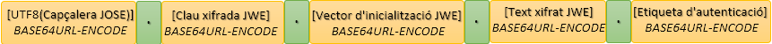

# 1. Introducció

De manera addicional a les altres modalitats de consum ofertes pel servei Hèstia, es disposa d'un servei de gestió d'avisos. Aquest servei ofereix la  possibilitat d'obtenir avisos de manera asíncrona quan es produeixen esdeveniments dins de l'aplicació. 

En aquesta modalitat d'avisos és el servei de l'Hèstia el que realitza una anomenada a una API Rest que ha de ser proporcionada per l'integrador. Aquesta API Rest pot estar implementada en el llenguatge de programació que l'integrador determini. No obstant això, ha de complir una sèrie de requisits perquè la comunicació sigui  possible. 

Per a això, es fixa com a format d'intercanvi de dades JSON. A més, amb  la finalitat de protegir la transmissió de missatges es fixa com a canal de comunicació HTTPS i com a protocol de protecció del contingut dels missatges JWE (JSON Web Encryption).

Per a encriptar els missatges a través de JWE serà necessari que l'integrador subministri una contrasenya robusta i  la comuniqui a través d'un canal segur. És important per a assegurar la  integritat del sistema que l'integrador implementi les mesures  necessàries per a evitar que es trenqui la cadena de custòdia.

En qualsevol cas, encara que l'API ha de ser subministrada pel client,  aconsellem que el servei compleixi totes les mesures indicades per  l'Esquema Nacional de Seguretat (ENS).

Dins de les modalitats d'avís disponibles en el servei, en l'actualitat només està disponible ENTRADA_RECURS. Aquest avís informés l'integrador del canvi d'estat d'una sèrie de recursos.


# 2. Estàndard de protecció per a l'enviament de missatges
Per a garantir una transmissió segura entre servei de l'Hèstia i els integradors s'estableix com a protocol de protecció per als missatges l'estàndard JOSE (JSON Object Signing and Encryption). Aquesta norma proporciona un enfocament general per a signar i encriptar qualsevol tipus de contingut. Està concebuda per al seu ús en aplicacions web i està construïda sobre JSON i base64url.

Aquest estàndard està compost per diversos RFCs. No obstant això, per a la codificació dels missatges ens restringirem a l'ús de JWE (JSON Web Encryption). Aquest estàndard se centra en l'encriptació de missatges i la seva comunicació. La seva norma queda recollida en:  https://tools.ietf.org/html/rfc7516.

En l'elaboració dels missatges adoptarem com a algorisme criptogràfic per a protegir la clau xifrada AES GCM amb una contrasenya de 256-bit (A256GCMKW) i com a algorisme simètric per a protegir el text xifrat també AES GCM usant una clau de 256-bit (A256GCM). Sàrria necessària, com ja hem indicat, que l'integrador acordi contrasenya per a l'encriptació que haurà de ser subministrada al servei Hèstia través d'un canal segur.


## 2.1 JWE serialització compacta

L'especificació JWE (JSON Web Encryption) estandarditza la manera de representar un contingut xifrat. Defineix  dues formes de serialització per a representar un missatge xifrat. Una  serialització compacta i una serialització en format JSON. Tots dos  formats comparteixen els mateixos fonaments criptogràfics. Encara que,  per a la comunicació amb el servei Hèstia ens restringirem a l'ús del format compacte. No descriurem el funcionament de JWE atès que estan àmpliament descrits en la norma. No obstant això, veurem alguns aspectes bàsics centrats en el format que genera.

La serialització compacta de JWE es basa en l'enviament de la informació en format Token JWE. Aquest token es construeix a través de cinc components cadascun separat per un punt (.). Aquests components són: encapçalat JWE JOSE, clau xifrada JWE, vector d'inicialització JWE, text xifrat i etiqueta d'autenticació JWE.





Vegem succintament el contingut de cadascuna aquestes parts:

1- L'encapçalat JWE: conté un JSON no encriptat formatat en BASE64. Aquest JSON es pot usar per a transmetre informació no sensible per part de  l'emissor. Però a més serveix per a definir les operacions  criptogràfiques associades al Token JWE. Per a la implementació de JWE almenys ha de contenir: 

* alg: identifica l'algorisme criptogràfic utilitzat per a protegir la clau xifrada JWE.
* enc: identifica l'algorisme de xifratge simètric utilitzat per a protegir el text xifrat.

A més, depenent de l'algorisme de codificació poden ser necessari el camp:

* iv: conté valor del vector d'inicialització (iv) codificat en base64 per als algorismes de codificació que el requereixin. Aquest paràmetre d'encapçalat és opcional.

A part d'aquests valors, tal com ja hem comentat, pot contenir valors útils per al receptor indicats per l'emissor com:

* jti: identificador únic (que pot servir per a realitzar una traçabilitat).

* iat: data de creació.

2- Clau xifrada JWE: és la clau que es xifra amb la clau del destinatari desitjat i el  contingut xifrat resultant es registra com una matriu de bytes, que es  coneix com la clau xifrada de JWE. 

3- Vector d'inicialització JWE: valor del vector d'inicialització utilitzat en xifrar el text sense format.

4- Text xifrat JWE: resultat de xifrar el text. Aquest text pot estar formatat o no.

5- Etiqueta d'autenticació JWE: depenent de l'algorisme de xifratge pot generar una etiqueta  d'autenticació que serveix per a garantir la integritat del text xifrat.


## 2.2 Exemple de token JWE

Un possible exemple de Token JWE seria:

```
eyJhbGciOiJBMjU2R0NNS1ciLCJpdiI6ImkzcE5kMW01NU04Ymo1cnIiLCJ0YWciOiI4VDZyZ2lnNVJwQnROblBwTWJMVmFnIiwiZW5jIjoiQTI1NkdDTSIsImp0aSI6IjMyMTU2ODc1NTYiLCJpYXQiOjE2NDAyNDE3MjV9.Q723jUVrJx85NOi8pKcsGixvELDxfyxLP9Gj_8IGhco.tNJ0Qm5UyryrlQrX.ZfBbIohyTSG5yHACeEPhgk9WiLtk2HF9p2aZ0rsZvrt6khUP8_83Yw.oyW5I78IRC8lrr79tP5ZMg
```
Si descodifiquem de base64 l'encapçalat JWE, que equivaldria fins al primer punt, contindria:

```json
{"alg":"A256GCMKW",
 "iv":"i3pNd1m55M8bj5rr",
 "tag":"8T6rgig5RpBtNnPpMbLVag",
 "enc":"A256GCM",
 "jti":"3215687556",
 "iat":1640241725}
```


## 2.3 Implementacions suggerides
La majoria de les llibreries existents ja s'encarreguen de generar els Token JWE d'una manera simple. Entre totes les implementacions existents se suggereix l'ús de les llibreries:

* Java: nimbus-jose-jwt
* .NET: jose-jwt


## 2.4 Protocol de comunicació

L'API subministrada per l'integrador ha de contenir almenys un servei  que serà els responsables de rebre i tractar els avisos del servei Hèstia.


**Pas 1 - ** El servei d'avisos rebrà un avís en format JSON.

**Pas 2 - ** El servei genera un token JWE utilitzant la contrasenya subministrada per l'integrador.

**Pas 3 - ** El servei envia una petició HTTPS a l'integrador amb el token JWE enviat.

**Pas 4 - ** L'integrador rep el token.

**Pas 5 - ** L'integrador descodifica el token JWE utilitzant la seva contrasenya.

**Pas 6 - ** L'integrador gestiona l'avís i genera un JSON de resposta.

**Pas 7 - ** L'integrador codifica el JSON en un token JWE a través de la seva contrasenya.

**Pas 8 - ** L'integrador envia el token resultant al sistema d'avisos.

**Pas 9 - ** El servei descodifica el token.

**Pas 10 - ** El servei gestiona el JSON resultant.


# 3. Gestió d'avís

Una vegada concret el protocol de comunicació en aquest punt ens centrarem en la missatgeria corresponent al mateix sistema de gestió d'avisos


## 3.1. Avís ENTRADA_RECURS

Ara com ara aquest és l'únic tipus d'avís possible. 

### 3.1.1. Petició d'enviament

Tal com s'ha indicat prèviament la petició ha de ser enviada a través d'un token JWE en aquest punt ens restringirem al contingut de la petició. Aquesta té complir el següent format JSON:


| Element                                    | Descripció                                                   |
| ------------------------------------------ | :----------------------------------------------------------- |
| EntradaRecursRequest/**CodINE**            | Codi INE de l'Àrea Bàsica de Serveis Socials                 |
| EntradaRecursRequest/**IdUnicoRecurso**    | Identificador únic del recurs traspassat dins de l'Hèstia    |
| EntradaRecursRequest/**IdTipoRecurso**     | Identificador únic de la tipologia del recurs traspassat dins de l'Hèstia |
| EntradaRecursRequest/**IdProfesional**     | Identificador intern del professional que fes l'operació dins de l'Hèstia |
| EntradaRecursRequest/**NombreProfesional** | Nom del professional.                                        |

Exemple de petició realitzada amb [Postman](https://www.postman.com/)


### 3.1.2. Resposta
Com a resultat de la crida el servei d'autenticació es retornarà en format JSON la següent estructura:


Els possibles resultats són:

|Element | Descripció|
|------- | ----------|
|EntradaRecursResponse/resultat/codiResultat | -1: La petició no és correcta o no compleix l’esquema|
| | -2: Token no vàlid. El token subministrat no compleix l'esquema JWE o no es descodifica correctament. |
| | 0: Operació completada amb èxit. L'avís ha estat correctament tractat. |
|EntradaRecursResponse/resultat/descripcio| Missatge descriptiu del resultat de l’operació. En cas d’error es detallen els motius.|


Exemple de petició realitzada amb [Postman](https://www.postman.com/)


### 3.1.3.  Joc de proves
El joc de proves del servei vàlid per a l’entorn de pre-producció, és el que es detalla a continuació:

|CodINE |IdUnicoRecurso | IdTipoRecurso | IdProfesional | NombreProfesional | Token | Resultat|
|------- | --------------- | --- | --- | --- | -------- |------- |
| 9821920002	| 840998044	| 370000144 | 370000126 | MARIA COLLADO MARTÍNEZ | Ok | (0)  Operació completada amb èxit|
| -1	| -1	| -1 | -1 | no vàlid | Ok | (-1) La petició no és correcta o no compleix l’esquema |
| 9821920002	| 840998044	| 370000144 | 370000126 | MARIA COLLADO MARTÍNEZ | Invàlid | (-2) Token no vàlid|


### 3.1.4.  Petició d'exemple

```json
{
    "CodINE": 9821920002,    
    "IdUnicoRecurso": 840998044,
    "IdTipoRecurso": 370000144,
    "IdProfesional": 370000126,
    "NombreProfesional": "MARIA COLLADO MARTÍNEZ"
}
```


### 3.1.5.  Resposta d'exemple

```json
{
    "resultat": {
        "codiResultat": "0",
        "descripcio": "Operació completada amb èxit."
    }
}
```

