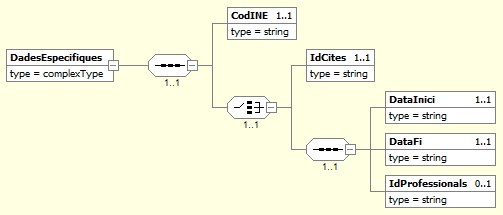
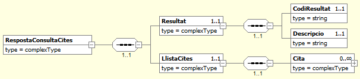
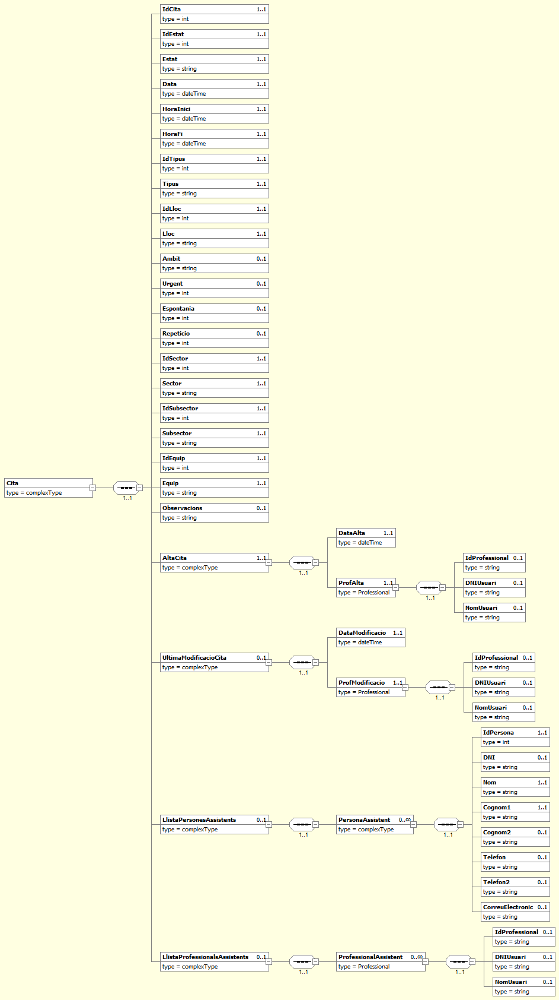

# 1. Consulta Cites Agenda (HESTIA_CITES)

El servei **Hèstia** disposa d'un mòdul encarregat de gestionar l'agenda dels seus professionals. A través d'aquest mòdul és possible registrar cites entre els usuaris dels serveis socials i els professionals que els presten servei. Aquest connector ens permet obtenir les dades d'una o diverses cites donades d'alta en el sistema.

Existeixen dues maneres de realitzar la consulta, en els dos casos és obligatori indicar del codi INE de l'ABSS (`CodINE`) que es vol consultar i únicament es retornaran cites d'aquesta ABSS. El primer mètode de consulta consisteix a indicar una llista d'identificadors interns de l’**Hèstia** d'una o més cites (`IdCites`). Aquest mètode ens serà d'utilitat per a actualitzar la informació de les cites que han estat localitzades amb anterioritat a través del segon mètode de consulta. El límit màxim que es pot sol·licitar en una única petició és de 100 cites.

El segon mètode de consulta, és una cerca en l'agenda mitjançant un rang de dates. Haurem d'indicar el paràmetre de data d'inici (`DataInici`) i el paràmetre de data de fi (`DataFi`). Com a màxim es permet sol·licitar les cites registrades en un rang de set dies. En el cas que vulguem limitar la cerca, tenim un paràmetre addicional (`IdProfessionals`) on podem indicar una llista de professionals per a restringir la nostra cerca. Com en la llista anterior, el límit màxim de professionals a filtrar serà de 100.

En cas d’indicar més d’un paràmetre, el connector farà la següent priorització:

1.	Si s'especifica una llista de cites  (`IdCites`), el connector ignorarà la resta dels paràmetres indicats i únicament retornarà les cites localitzades a partir del seu identificador intern dins l’**Hèstia**. Recorda però, que només es retornaran les cites que pertanyin a l'ABSS indicada (`CodINE`).
2.	Si no s'indica una llista de cites, el connector retornarà totes les cites registrades en l'agenda de l'ABSS indicada (`CodINE`) compreses entre la data d'inici (`DataInici`) i la data de fi (`DataFi`). En el cas que s'indiqui una llista d'identificadors interns de professionals (`IdProfessionals`), només es retornaran les cites del rang indicat que incloguin a algun d'aquests professionals com a assistents.

Si no s’indica cap dels paràmetres, el connector retornarà un codi d’error. S'ha de tenir en compte que actualment només es permet la consulta de les cites de la pròpia ABSS que realitza la petició.

A continuació es detalla la missatgeria corresponent al bloc de dades específiques. 


## 1.1. Petició - dades específiques

La missatgeria específica de la petició *HESTIA_CITES* es troba definida al document [Peticio_DadesEspecifiques_Cites.xsd](xsd/Peticio_DadesEspecifiques_Cites.xsd)



| Element                               | Descripció                                                   |
| ------------------------------------- | :----------------------------------------------------------- |
| DadesEspecifiques/**CodINE**          | Codi INE de l'Àrea Bàsica de Serveis Socials                 |
| DadesEspecifiques/**IdCites**         | Llista d'Identificadors interns de les cites dins l’**Hèstia**. Aquest és el paràmetre que recomanem utilitzar sempre que sigui possible (especialment per consultes futures sobre una mateixa cita) |
| DadesEspecifiques/**DataInici**       | Data inicial per a realitzar la consulta sobre les cites dins de l'agenda. El rang de dies permès no ha de superar els set dies |
| DadesEspecifiques/**DataFi**          | Data final per a realitzar la consulta sobre les cites dins de l'agenda. El rang de dies permès no ha de superar els set dies |
| DadesEspecifiques/**IdProfessionals** | Llista d'identificadors interns del professional dins l’**Hèstia**. Aquest paràmetre és opcional i en el cas d'aparèixer restringeix la cerca als professionals indicats |

## 1.2. Resposta - dades específiques

La missatgeria específica de la resposta *HESTIA_CITES* es troba definida al document [Resposta_DadesEspecifiques_Cites.xsd](xsd/Resposta_DadesEspecifiques_Cites.xsd)



| Element                                         | Descripció                                                   |
| ----------------------------------------------- | ------------------------------------------------------------ |
| RespostaConsultaCites/Resultat/**CodiResultat** | -1: La petició no és correcta o no compleix l’esquema        |
|                                                 | -2: No s'ha localitzat la cita. No es retorna l’apartat **LlistaCites** |
|                                                 | -6: El servei Hèstia no està disponible en aquest moment. La petició s’ha de tornar a enviar més endavant |
|                                                 | -9: Només es pot accedir a informació de la pròpia ABSS que realitza la consulta |
|                                                 | 0: Les cites s'han localitzat correctament. Es retorna a l’apartat **LlistaCites** les cites sol·licitades |
| RespostaConsultaCites/Resultat/**Descripcio**   | Missatge descriptiu del resultat de l’operació. En cas d’error es detallen els motius |
| RespostaConsultaCites/**LlistaCites/**          | Llista de cites localitzades, apareixerà buida en cas d'error |

### 1.2.1. LlistaExpedients/Expedient



| Element                                                      | Descripció                                                   |
| ------------------------------------------------------------ | ------------------------------------------------------------ |
| //Cita/**IdCita**                                            | Identificador únic intern de la cita dins l’Hèstia. Per a futures consultes es recomana emprar aquest identificador si es desitja consultar aquesta cita més endavant |
| //Cita/**IdEstat**                                           | Identificador intern de l'estat de la cita                   |
| //Cita/**Estat**                                             | Estat en el qual es troba la cita:                           |
|                                                              | 0: Pendent                                                   |
|                                                              | 1: Realitzada                                                |
|                                                              | 2: No realitzada                                             |
|                                                              | 3: Anul·lada professional                                    |
|                                                              | 4: Anul·lada persona usuària                                 |
|                                                              | 5: No acut                                                   |
| //Cita/**Data**                                              | Data en la qual es realitza la cita                          |
| //Cita/**HoraInici**                                         | Hora d'inici de la cita                                      |
| //Cita/**HoraFi**                                            | Hora de fi de la cita                                        |
| //Cita/**IdTipus**                                           | Identificador del tipus de cita que es realitza             |
| //Cita/**Tipus**                                             | Descripció del tipus de cita que es realitza:               |
|                                                              | 0: Sense assignar                                            |
|                                                              | 1: Entrevista                                                |
|                                                              | 2: Acompanyament                                             |
|                                                              | 3: Reunió tècnica                                            |
|                                                              | 4: Reunió coordinació                                        |
|                                                              | 5: Supervisió                                                |
|                                                              | 6: Formació                                                  |
|                                                              | 7: Gestió                                                    |
|                                                              | 8: Documentació                                              |
| //Cita/**IdLloc**                                            | Identificador únic d'on es realitza la cita                  |
| //Cita/**Lloc**                                              | Descripció del lloc on es realitza la cita:                  |
|                                                              | 0: Sense assignar                                            |
|                                                              | 1: Dependències de l'Ebasp                                   |
|                                                              | 2: Carrer                                                    |
|                                                              | 3: Ens local                                                 |
|                                                              | 4: Serveis d'ensenyament                                     |
|                                                              | 5: Domicili                                                  |
|                                                              | 6: Telèfon, fax, mail, correus                               |
|                                                              | 7: Serveis sanitaris                                         |
|                                                              | 8: Cossos de seguretat                                       |
|                                                              | 9: Altres serveis socials                                    |
|                                                              | 10: Domicili per dependència                                 |
|                                                              | 11: Oficina de la Generalitat - OBSF                         |
| //Cita/**Ambit**                                             | Descripció de l'àmbit, en el cas que s'indiqui, en el qual es troba comprès la cita: |
|                                                              | - Primera Entrevista                                         |
|                                                              | - Seguiment                                                  |
| //Cita/**Urgent**                                            | Indica si la cita té un caràcter urgent:                     |
|                                                              | 0: No                                                        |
|                                                              | 1: Sí                                                        |
| //Cita/**Espontania**                                        | Indica si la cita és de caràcter espontani:                  |
|                                                              | 0: No                                                        |
|                                                              | 1: Sí                                                        |
| //Cita/**Repeticio**                                         | Indica si aquesta cita ha estat donada d'alta de forma periòdica en l'agenda: |
|                                                              | 0: No                                                        |
|                                                              | 1: Sí                                                        |
| //Cita/**IdSector**                                          | Identificador únic del sector al qual pertany la cita (primer nivell de la divisió territorial a la qual pertanyen la cita i que normalment es correspon amb el municipi) |
| //Cita/**Sector**                                            | Descripció del sector al qual pertany la cita                |
| //Cita/**IdSubsector**                                       | Identificador únic del subsector al qual pertany la cita (segon nivell de la divisió territorial a la qual pertany la cita i que normalment es correspon amb el barri) |
| //Cita/**Subsector**                                         | Descripció del subsector al qual pertany la cita             |
| //Cita/**IdEquip**                                           | Identificador de l'equip que té registrada la cita           |
| //Cita/**Equip**                                             | Descripció de l'equip especialitzat o temàtic assignat a la cita |
| //Cita/**Observacions**                                      | Observacions que han estat anotades en la cita               |
| //Cita/**AltaCita/**                                         | Informació sobre l'alta de la cita                           |
| //Cita/AltaCita/**DataAlta**                                 | Data d'alta de la cita                                       |
| //Cita/AltaCita/**ProfAlta/**                                | Professional que va donar d'alta la cita                     |
| //Cita/AltaCita/ProfAlta/**IdProfessional**                  | Identificador dins l’**Hèstia** del professional que ha donat d'alta la cita |
| //Cita/AltaCita/ProfAlta/**DNIUsuari**                       | DNI/NIE del professional que va donar d'alta la cita         |
| //Cita/AltaCita/ProfAlta/**NomUsuari**                       | Nom del professional que va donar d'alta la cita             |
| //Cita/**UltimaModificacioCita/**                            | Informació sobre la darrera modificació que s'ha realitzat en la cita |
| //Cita/UltimaModificacioCita/**DataModificacio**             | Data de la darrera modificació que s'ha realitzat en la cita   |
| //Cita/UltimaModificacioCita/**ProfModificacio/**            | Informació sobre el professional que ha realitzat la darrera modificació en la cita |
| //Cita/UltimaModificacioCita/ProfModificacio/ **IdProfessional** | Identificador dins l’Hèstia del darrer professional que va modificar la cita |
| //Cita/UltimaModificacioCita/ProfModificacio/ **DNIUsuari**  | DNI/NIE del darrer professional que va modificar la cita     |
| //Cita/UltimaModificacioCita/ProfModificacio/ **NomUsuari**  | Nom del darrer professional que va modificar la cita         |
| //Cita/**LlistaPersonesAssistents/**                         | Relació de persones convocades a la cita                     |
| //Cita/LlistaPersonesAssistents/**PersonaAssistent/**        | Informació sobre la persona assistent a la cita              |
| //Cita/LlistaPersonesAssistents/PersonaAssistent/ **IdPersona** | Identificador intern dins l’Hèstia de la persona assistent|
| //Cita/LlistaPersonesAssistents/PersonaAssistent/ **DNI**    | DNI/NIE/Passaport de la persona assistent                    |
| //Cita/LlistaPersonesAssistents/PersonaAssistent/ **Nom**    | Nom de la persona assistent                                  |
| //Cita/LlistaPersonesAssistents/PersonaAssistent/ **Cognom1** | Primer cognom de la persona assistent                       |
| //Cita/LlistaPersonesAssistents/PersonaAssistent/ **Cognom2** | Segon cognom de la persona assistent                        |
| //Cita/LlistaPersonesAssistents/PersonaAssistent/ **Telefon** | Primer telèfon associat a la persona assistent              |
| //Cita/LlistaPersonesAssistents/PersonaAssistent/ **Telefon2** | Segon telèfon associat a la persona assistent              |
| //Cita/LlistaPersonesAssistents/PersonaAssistent/ **CorreuElectronic** | Correu electrònic de contacte de la persona assistent|
| //Cita/**LlistaProfessionalsAssistents/**                    | Llista de professionals convocats a la cita                  |
| //Cita/LlistaProfessionalsAssistents/ **ProfessionalAssistent/** | Informació del professional assistent a la cita              |
| //Cita/LlistaProfessionalsAssistents/ ProfessionalAssistent/**IdProfessional** | Identificador intern dins l’Hèstia del professional          |
| //Cita/LlistaProfessionalsAssistents/ ProfessionalAssistent/**DNIUsuari** | DNI/NIE del professional                                     |
| //Cita/LlistaProfessionalsAssistents/ ProfessionalAssistent/**NomUsuari** | Nom del professional                                         |


## 1.3. Joc de proves

El joc de proves del servei vàlid per a l’entorn de pre-producció, és el que es detalla a continuació:

| codINE     | IdCites                         | DataInici                | DataFi                   | IdProfessionals                 | Resultat                                                     |
| ---------- | ------------------------------- | ------------------------ | ------------------------ | ------------------------------- | ------------------------------------------------------------ |
| 999999999  |                                 |                          |                          |                                 | (-9) Només es pot accedir a informació de la pròpia ABSS que realitza la consulta |
| 9821920002 | 999999999                       |                          |                          |                                 | (-2) No s'ha localitzat la cita                              |
| 9821920002 | 841265XYZ                       |                          |                          |                                 | (-1) La petició no és correcta o no compleix l’esquema       |
| 9821920002 | 999999999                       |                          |                          |                                 | (-2) No s'ha localitzat la cita                              |
| 9821920002 |                                 | 1990-01-01T 00:00:00.000 | 1990-01-01T 00:00:00.000 |                                 | (-2) No s'ha localitzat la cita                              |
| 9821920002 | 999999999                       | 2019-05-06T 00:00:00.000 | 2019-05-13T 00:00:00.000 |                                 | (-2) No s'ha localitzat la cita                              |
| 9821920002 | 841265254, 841207329, 841455818 |                          |                          |                                 | (0) Les cites s'han localitzat correctament                  |
| 9821920002 |                                 | 2019-05-06T 00:00:00.000 | 2019-05-13T 00:00:00.000 |                                 | (0) Les cites s'han localitzat correctament                  |
| 9821920002 |                                 | 2019-05-06T 00:00:00.000 | 2019-05-13T 00:00:00.000 | 370000052, 370000062, 370000130 | (0) Les cites s'han localitzat correctament                  |

## 1.4. Petició d'exemple

```xml
<soapenv:Envelope xmlns:nt="http://www.aocat.net/hestia/" xmlns:soapenv="http://schemas.xmlsoap.org/soap/envelope/">
   <soapenv:Body>
      <nt:procesa xmlns:nt="http://www.openuri.org/">
         <ns0:Peticion xmlns:ns0="http://gencat.net/scsp/esquemes/peticion">
            <ns0:Atributos>
               <ns0:IdPeticion>HESTIA_CITES_${=UUID.randomUUID()}</ns0:IdPeticion>
               <ns0:NumElementos>1</ns0:NumElementos>
               <ns0:CodigoCertificado>HESTIA_CITES</ns0:CodigoCertificado>
               <ns0:CodigoProducto>HESTIA</ns0:CodigoProducto>
               <ns0:DatosAutorizacion>
                  <ns0:IdentificadorSolicitante>2512070005</ns0:IdentificadorSolicitante>
                  <ns0:Finalidad>PROVES</ns0:Finalidad>
               </ns0:DatosAutorizacion>
            </ns0:Atributos>
            <ns0:Solicitudes>
               <ns0:SolicitudTransmision>
                  <ns0:DatosGenericos>
                     <ns0:Solicitante>
                        <ns0:IdentificadorSolicitante>9821920002</ns0:IdentificadorSolicitante>
                        <ns0:NombreSolicitante>CAOC</ns0:NombreSolicitante>
                        <ns0:Finalidad>PROVES</ns0:Finalidad>
                        <ns0:Consentimiento>Si</ns0:Consentimiento>
                     </ns0:Solicitante>
                     <ns0:Transmision>
                        <ns0:CodigoCertificado>HESTIA_CITES</ns0:CodigoCertificado>
                        <ns0:IdSolicitud>171254</ns0:IdSolicitud>
                        <ns0:FechaGeneracion>2013-10-02</ns0:FechaGeneracion>
                     </ns0:Transmision>
                  </ns0:DatosGenericos>
                  <ns0:DatosEspecificos>
                     <DadesEspecifiques xmlns="http://www.aoc.cat/hestia/">
                        <CodINE>9821920002</CodINE>
                        <IdCites>841265254,841207329,841455818</IdCites>
                     </DadesEspecifiques>
                  </ns0:DatosEspecificos>
               </ns0:SolicitudTransmision>
            </ns0:Solicitudes>
         </ns0:Peticion>
      </nt:procesa>
   </soapenv:Body>
</soapenv:Envelope>
```


## 1.5. Resposta d'exemple

```xml
<S:Envelope xmlns:S="http://schemas.xmlsoap.org/soap/envelope/">
   <S:Body>
      <ns0:procesaResponse xmlns:ns0="http://www.openuri.org/" xmlns:ns3="http://gencat.net/scsp/esquemes/respuesta" xmlns:ns2="http://gencat.net/scsp/esquemes/peticion">
         <ns3:Respuesta>
            <ns3:Atributos>
               <ns3:IdPeticion>HESTIA_CITES_b0696f6b-9466-42bd-a75a-0c7f8a01c00b</ns3:IdPeticion>
               <ns3:NumElementos>1</ns3:NumElementos>
               <ns3:TimeStamp>2020-04-20T14:01:38.993+02:00</ns3:TimeStamp>
               <ns3:Estado>
                  <ns3:CodigoEstado>0003</ns3:CodigoEstado>
                  <ns3:LiteralError>OK</ns3:LiteralError>
                  <ns3:TiempoEstimadoRespuesta>0</ns3:TiempoEstimadoRespuesta>
               </ns3:Estado>
               <ns3:CodigoCertificado>HESTIA_CITES</ns3:CodigoCertificado>
               <ns3:CodigoProducto>HESTIA</ns3:CodigoProducto>
            </ns3:Atributos>
            <ns3:Transmisiones>
               <ns3:TransmisionDatos>
                  <ns3:DatosGenericos>
                     <ns3:Solicitante>
                        <ns3:IdentificadorSolicitante>9821920002</ns3:IdentificadorSolicitante>
                        <ns3:NombreSolicitante>CAOC</ns3:NombreSolicitante>
                        <ns3:Finalidad>PROVES</ns3:Finalidad>
                        <ns3:Consentimiento>Si</ns3:Consentimiento>
                     </ns3:Solicitante>
                     <ns3:Transmision>
                        <ns3:CodigoCertificado>HESTIA_CITES</ns3:CodigoCertificado>
                        <ns3:IdSolicitud>171254</ns3:IdSolicitud>
                        <ns3:IdTransmision/>
                        <ns3:FechaGeneracion>2013-10-02</ns3:FechaGeneracion>
                     </ns3:Transmision>
                  </ns3:DatosGenericos>
                  <ns3:DatosEspecificos>
                     <RespostaConsultaCites xmlns="http://www.aoc.cat/hestia/" xmlns:xsd="http://www.w3.org/2001/XMLSchema" xmlns:xsi="http://www.w3.org/2001/XMLSchema-instance">
                        <Resultat>
                           <CodiResultat>0</CodiResultat>
                           <Descripcio>Les cites s'han localitzat correctament</Descripcio>
                        </Resultat>
                        <LlistaCites>
                           <Cita>
                              <IdCita>841265254</IdCita>
                              <IdEstat>1</IdEstat>
                              <Estat>Realitzada</Estat>
                              <Data>2019-02-15T00:00:00</Data>
                              <HoraInici>2019-02-15T13:00:00</HoraInici>
                              <HoraFi>2019-02-15T14:30:00</HoraFi>
                              <IdTipus>0</IdTipus>
                              <Tipus>Sense assignar</Tipus>
                              <IdLloc>9</IdLloc>
                              <Lloc>Altres serveis socials</Lloc>
                              <Urgent>1</Urgent>
                              <Espontania>1</Espontania>
                              <Repeticio>0</Repeticio>
                              <IdSector>251207</IdSector>
                              <Sector>Lleida</Sector>
                              <IdSubsector>370000000</IdSubsector>
                              <Subsector>Democràcia</Subsector>
                              <IdEquip>370000002</IdEquip>
                              <Equip>ZONA 1 - BARRI ANTIC</Equip>
                              <Observacions>text</Observacions>
                              <AltaCita>
                                 <DataAlta>2019-02-13T13:21:56.933</DataAlta>
                                 <ProfAlta>
                                    <IdProfessional>370000067</IdProfessional>
                                    <DNIUsuari>00001125K</DNIUsuari>
                                    <NomUsuari>IZAN EL MANSOURI GOMIS</NomUsuari>
                                 </ProfAlta>
                              </AltaCita>
                              <UltimaModificacioCita>
                                 <DataModificacio>2019-02-28T18:55:51.027</DataModificacio>
                                 <ProfModificacio>
                                    <IdProfessional>370000065</IdProfessional>
                                    <DNIUsuari>00001187Z</DNIUsuari>
                                    <NomUsuari>Mº TERESA BECERRA MATEU</NomUsuari>
                                 </ProfModificacio>
                              </UltimaModificacioCita>
                              <LlistaProfessionalsAssistents>
                                 <ProfessionalAssistent>
                                    <IdProfessional>370000027</IdProfessional>
                                    <DNIUsuari>00000291S</DNIUsuari>
                                    <NomUsuari>CLAUDIA TORRES BORRAS</NomUsuari>
                                 </ProfessionalAssistent>
                                 <ProfessionalAssistent>
                                    <IdProfessional>370000030</IdProfessional>
                                    <DNIUsuari>00000227C</DNIUsuari>
                                    <NomUsuari>SOFIA BRAVO ALFARO</NomUsuari>
                                 </ProfessionalAssistent>
                                 <ProfessionalAssistent>
                                    <IdProfessional>370000065</IdProfessional>
                                    <DNIUsuari>00001187Z</DNIUsuari>
                                    <NomUsuari>Mº TERESA BECERRA MATEU</NomUsuari>
                                 </ProfessionalAssistent>
                                 <ProfessionalAssistent>
                                    <IdProfessional>370000067</IdProfessional>
                                    <DNIUsuari>00001125K</DNIUsuari>
                                    <NomUsuari>IZAN EL MANSOURI GOMIS</NomUsuari>
                                 </ProfessionalAssistent>
                                 <ProfessionalAssistent>
                                    <IdProfessional>370000120</IdProfessional>
                                    <DNIUsuari>00001454M</DNIUsuari>
                                    <NomUsuari>FATIMA ZAHRA ALBA CHEN</NomUsuari>
                                 </ProfessionalAssistent>
                                 <ProfessionalAssistent>
                                    <IdProfessional>370000144</IdProfessional>
                                    <DNIUsuari>00000603M</DNIUsuari>
                                    <NomUsuari>MARIA ANGELES MALDONADO VASQUEZ</NomUsuari>
                                 </ProfessionalAssistent>
                              </LlistaProfessionalsAssistents>
                           </Cita>
                           <Cita>
                              <IdCita>841207329</IdCita>
                              <IdEstat>5</IdEstat>
                              <Estat>No acut</Estat>
                              <Data>2019-02-28T00:00:00</Data>
                              <HoraInici>2019-02-28T11:00:00</HoraInici>
                              <HoraFi>2019-02-28T12:00:00</HoraFi>
                              <IdTipus>0</IdTipus>
                              <Tipus>Sense assignar</Tipus>
                              <IdLloc>1</IdLloc>
                              <Lloc>Dependències de l'Ebasp</Lloc>
                              <Ambit>Seguiment</Ambit>
                              <Urgent>1</Urgent>
                              <Espontania>1</Espontania>
                              <Repeticio>0</Repeticio>
                              <IdSector>251207</IdSector>
                              <Sector>Lleida</Sector>
                              <IdSubsector>370000003</IdSubsector>
                              <Subsector>Balàfia</Subsector>
                              <IdEquip>370000004</IdEquip>
                              <Equip>ZONA 3 - NORD-EST</Equip>
                              <AltaCita>
                                 <DataAlta>2019-01-31T12:15:05.597</DataAlta>
                                 <ProfAlta>
                                    <IdProfessional>370000133</IdProfessional>
                                    <DNIUsuari>00000089C</DNIUsuari>
                                    <NomUsuari>REMEDIOS NAVIDAD BARRIOS</NomUsuari>
                                 </ProfAlta>
                              </AltaCita>
                              <UltimaModificacioCita>
                                 <DataModificacio>2019-02-28T13:09:31.08</DataModificacio>
                                 <ProfModificacio>
                                    <IdProfessional>370000133</IdProfessional>
                                    <DNIUsuari>00000089C</DNIUsuari>
                                    <NomUsuari>REMEDIOS NAVIDAD BARRIOS</NomUsuari>
                                 </ProfModificacio>
                              </UltimaModificacioCita>
                              <LlistaPersonesAssistents>
                                 <PersonaAssistent>
                                    <IdPersona>370037319</IdPersona>
                                    <DNI>00210822G</DNI>
                                    <Nom>NOELIA</Nom>
                                    <Cognom1>SANAHUJA</Cognom1>
                                    <Cognom2>CLAVIJO</Cognom2>
                                    <Telefon>551210822</Telefon>
                                    <Telefon2>551210822</Telefon2>
                                 </PersonaAssistent>
                                 <PersonaAssistent>
                                    <IdPersona>370037320</IdPersona>
                                    <DNI>00262076Z</DNI>
                                    <Nom>ADORACION</Nom>
                                    <Cognom1>CHAVEZ</Cognom1>
                                    <Cognom2>PEDROL</Cognom2>
                                    <Telefon>551262076</Telefon>
                                    <Telefon2>551262076</Telefon2>
                                 </PersonaAssistent>
                                 <PersonaAssistent>
                                    <IdPersona>370037321</IdPersona>
                                    <DNI>00034560Z</DNI>
                                    <Nom>EMILIA</Nom>
                                    <Cognom1>CAMACHO</Cognom1>
                                    <Cognom2>TOST</Cognom2>
                                    <Telefon>551034560</Telefon>
                                    <Telefon2>551034560</Telefon2>
                                 </PersonaAssistent>
                                 <PersonaAssistent>
                                    <IdPersona>370037322</IdPersona>
                                    <DNI>00237161P</DNI>
                                    <Nom>JOSE LUIS</Nom>
                                    <Cognom1>MATEU</Cognom1>
                                    <Cognom2>BRU</Cognom2>
                                    <Telefon>551237161</Telefon>
                                    <Telefon2>551237161</Telefon2>
                                 </PersonaAssistent>
                              </LlistaPersonesAssistents>
                              <LlistaProfessionalsAssistents>
                                 <ProfessionalAssistent>
                                    <IdProfessional>370000133</IdProfessional>
                                    <DNIUsuari>00000089C</DNIUsuari>
                                    <NomUsuari>REMEDIOS NAVIDAD BARRIOS</NomUsuari>
                                 </ProfessionalAssistent>
                              </LlistaProfessionalsAssistents>
                           </Cita>
                           <Cita>
                              <IdCita>841455818</IdCita>
                              <IdEstat>1</IdEstat>
                              <Estat>Realitzada</Estat>
                              <Data>2019-04-04T00:00:00</Data>
                              <HoraInici>2019-04-04T09:30:00</HoraInici>
                              <HoraFi>2019-04-04T11:00:00</HoraFi>
                              <IdTipus>0</IdTipus>
                              <Tipus>Sense assignar</Tipus>
                              <IdLloc>1</IdLloc>
                              <Lloc>Dependències de l'Ebasp</Lloc>
                              <Ambit>Seguiment</Ambit>
                              <Urgent>1</Urgent>
                              <Espontania>1</Espontania>
                              <Repeticio>0</Repeticio>
                              <IdSector>251207</IdSector>
                              <Sector>Lleida</Sector>
                              <IdSubsector>370000001</IdSubsector>
                              <Subsector>Centre històric</Subsector>
                              <IdEquip>370000002</IdEquip>
                              <Equip>ZONA 1 - BARRI ANTIC</Equip>
                              <AltaCita>
                                 <DataAlta>2019-03-28T10:09:30.617</DataAlta>
                                 <ProfAlta>
                                    <IdProfessional>370000030</IdProfessional>
                                    <DNIUsuari>00000227C</DNIUsuari>
                                    <NomUsuari>SOFIA BRAVO ALFARO</NomUsuari>
                                 </ProfAlta>
                              </AltaCita>
                              <UltimaModificacioCita>
                                 <DataModificacio>2019-04-04T13:58:20.267</DataModificacio>
                                 <ProfModificacio>
                                    <IdProfessional>370000030</IdProfessional>
                                    <DNIUsuari>00000227C</DNIUsuari>
                                    <NomUsuari>SOFIA BRAVO ALFARO</NomUsuari>
                                 </ProfModificacio>
                              </UltimaModificacioCita>
                              <LlistaPersonesAssistents>
                                 <PersonaAssistent>
                                    <IdPersona>370060183</IdPersona>
                                    <DNI>00297403J</DNI>
                                    <Nom>DAMIAN</Nom>
                                    <Cognom1>VILLENA</Cognom1>
                                    <Cognom2>GASCON</Cognom2>
                                    <Telefon>551297403</Telefon>
                                    <Telefon2>551297403</Telefon2>
                                 </PersonaAssistent>
                              </LlistaPersonesAssistents>
                              <LlistaProfessionalsAssistents>
                                 <ProfessionalAssistent>
                                    <IdProfessional>370000027</IdProfessional>
                                    <DNIUsuari>00000291S</DNIUsuari>
                                    <NomUsuari>CLAUDIA TORRES BORRAS</NomUsuari>
                                 </ProfessionalAssistent>
                                 <ProfessionalAssistent>
                                    <IdProfessional>370000030</IdProfessional>
                                    <DNIUsuari>00000227C</DNIUsuari>
                                    <NomUsuari>SOFIA BRAVO ALFARO</NomUsuari>
                                 </ProfessionalAssistent>
                                 <ProfessionalAssistent>
                                    <IdProfessional>370000059</IdProfessional>
                                    <DNIUsuari>00000881F</DNIUsuari>
                                    <NomUsuari>TOMASA SANTOS CHERGUI</NomUsuari>
                                 </ProfessionalAssistent>
                                 <ProfessionalAssistent>
                                    <IdProfessional>490000449</IdProfessional>
                                    <DNIUsuari>00000910J</DNIUsuari>
                                    <NomUsuari>FERRAN LOSADA PORTEROS</NomUsuari>
                                 </ProfessionalAssistent>
                              </LlistaProfessionalsAssistents>
                           </Cita>
                        </LlistaCites>
                     </RespostaConsultaCites>
                  </ns3:DatosEspecificos>
               </ns3:TransmisionDatos>
            </ns3:Transmisiones>
         </ns3:Respuesta>
      </ns0:procesaResponse>
   </S:Body>
</S:Envelope>
```
