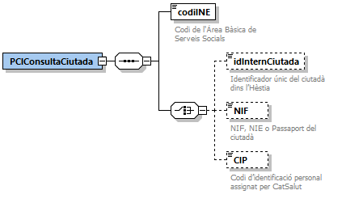
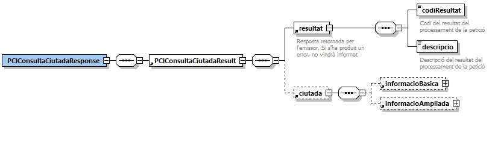
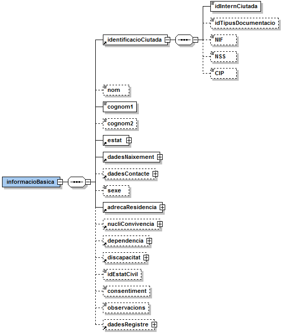
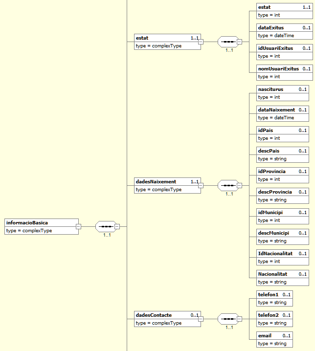
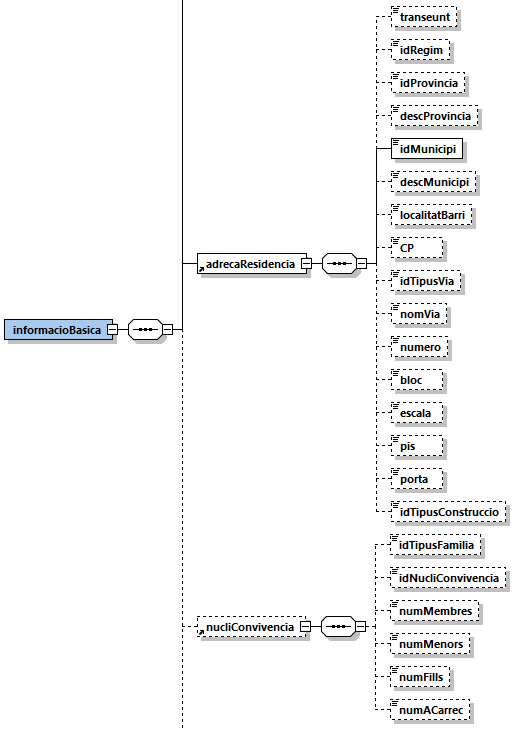
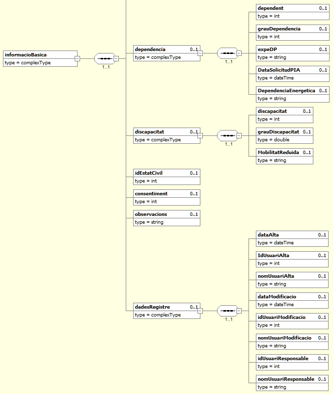
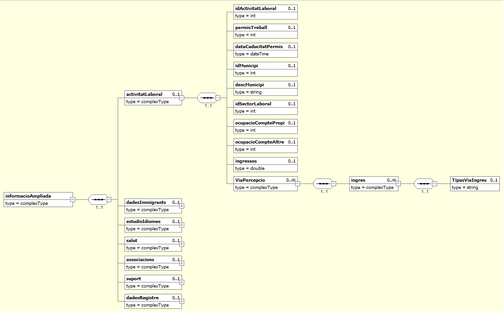
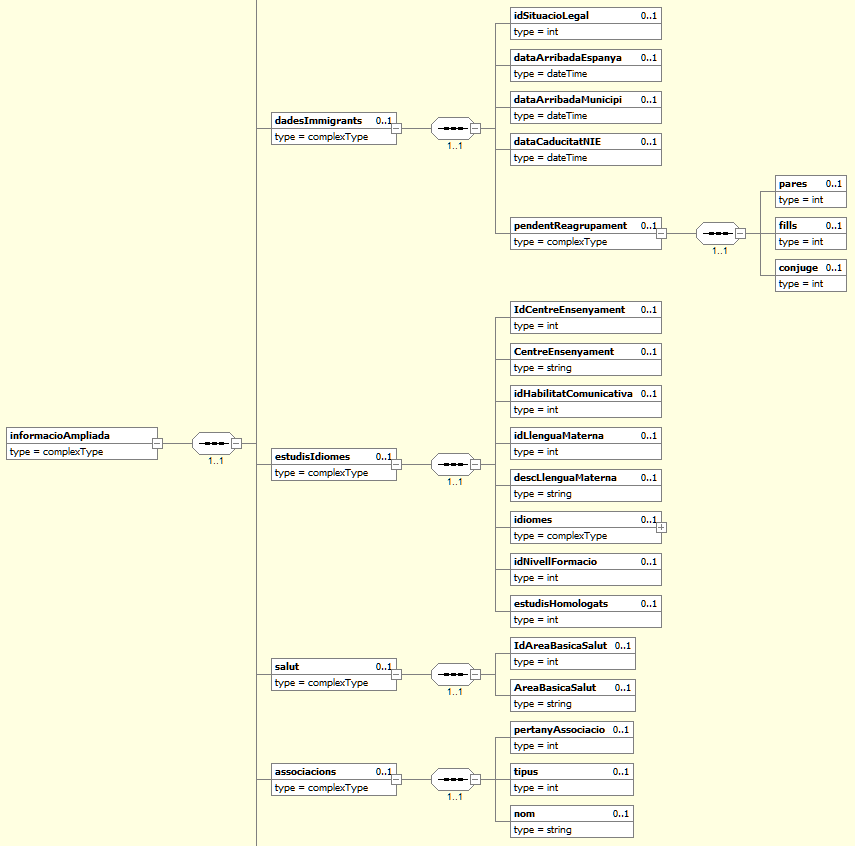
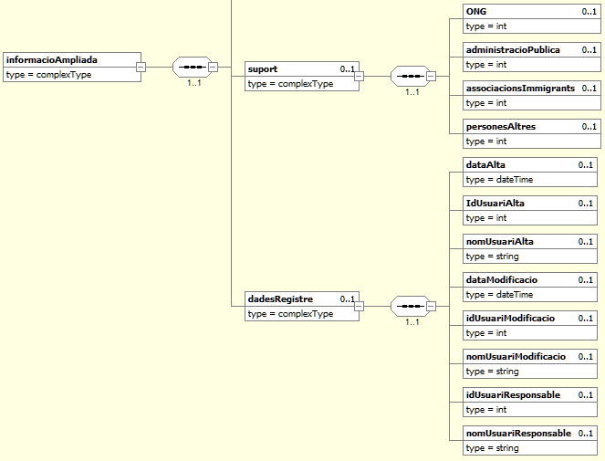

# 	1. Consulta fitxa de persona (HESTIA_CONSULTA_CIUTADA)
Aquesta operació permet consultar totes les dades disponibles d’un ciutadà a partir del seu identificador intern de l’**Hèstia**, NIF/NIE/Passaport o CIP (targeta sanitària). Es deu indicar obligatòriament el Codi de l'Àrea Bàsica de Serveis Socials on està ubicat el ciutadà i almenys uns dels 3 paràmetres d'identificació. En cas d’indicar més d’un paràmetre, el connector farà la següent priorització:
1.	Si s’especifica l’identificador intern de l’**Hèstia**, el connector ignorarà la resta de paràmetres indicats i retornarà les dades del ciutadà a partir de l’identificador intern.
2.	Si no s’indica l’identificador intern, i s’indica el NIF (també s’accepta NIE o passaport), el connector ignorarà el CIP indicat i retornarà les dades del ciutadà a partir del NIF (NIE o passaport).
3.	Si no s’indica l’identificador intern i tampoc el NIF, el connector retornarà les dades del ciutadà a partir del seu CIP.
Si no s’indica cap dels paràmetres, el connector retornarà un codi d’error. Si el ciutadà existeix, es retornen totes les seves dades i en cas contrari s’indicarà que no existeix.
S'ha de tenir en compte que actualment només es retornen dades de ciutadans que pertanyin a la pròpia ABSS que fa la consulta.
A continuació es detalla la missatgeria corresponent al bloc de dades específiques. 

## 1.1. Petició - dades específiques
La missatgeria específica de la petició *HESTIA_CONSULTA_CIUTADA* es troba definida al document [Peticio_DadesEspecifiques_Ciutada.xsd](xsd/Peticio_DadesEspecifiques_Ciutada.xsd)



|Element | Descripció|
|------- | ----------|
|PCIConsultaCiutada/codiINE | Codi de l'Àrea Bàsica de Serveis Socials|
|PCIConsultaCiutada/idInternCiutada | Identificador únic del ciutadà dins l’Hèstia|
|PCIConsultaCiutada/NIF | NIF, NIE o Passaport del ciutadà|
|PCIConsultaCiutada/CIP | Codi d’identificació personal assignat per CatSalut|

## 1.2. Resposta - dades específiques
La missatgeria específica de la resposta *HESTIA_CONSULTA_CIUTADA* es troba definida al document [Resposta_DadesEspecifiques_Ciutada.xsd](xsd/Resposta_DadesEspecifiques_Ciutada.xsd)



|Element | Descripció|
|------- | ----------|
|PCIConsultaCiutadaResponse/PCIConsultaCiutadaResult/resultat/codiResultat | -1: La petició no és correcta o no compleix l’esquema|
| | -2: El ciutadà no s’ha trobat. No es retorna l’apartat *ciutada*|
| | -6: El servei Hèstia no està disponible en aquest moment. La petició s’ha de tornar a enviar més endavant|
| | -9: Només es pot accedir a informació de la pròpia ABSS que realitza la consulta|
| | 0: el ciutadà s'ha localitzat correctament. Les seves dades es retornen a l’apartat *ciutadà*|
|PCIConsultaCiutadaResponse/PCIConsultaCiutadaResult/resultat/descripcio| Missatge descriptiu del resultat de l’operació. En cas d’error es detallen els motius.|

### 1.2.1. ciutada/informacioBasica








|Element | Descripció|
|------- | ----------|
|//informacioBasica/identificacioCiutada/idInternCiutada | Identificador únic del ciutadà dins l’Hèstia|
|//informacioBasica/identificacioCiutada/idTipusDocumentacio | Tipus de documentació:|
| | 0: NIF/NIE|
| | 1: Passaport|
| | 2: Altre|
| | 3: Cap|
| | 4: DNI (sense lletra)|
|//informacioBasica/identificacioCiutada/NIF | Número de document del ciutadà|
|//informacioBasica/identificacioCiutada/NSS | Número de seguretat Social del ciutadà|
|//informacioBasica/identificacioCiutada/CIP | Codi d’identificació personal assignat per CatSalut|
|//informacioBasica/nom | Nom del ciutadà|
|//informacioBasica/cognom1 | Primer cognom del ciutadà|
|//informacioBasica/cognom2 | Segon cognom del ciutadà|
|//informacioBasica/estat/estat | Estat de la fitxa del ciutadà:|
| | 0: Activa|
| | 1: Èxitus<a href="#noteExitus" id="noteExitusref"><sup>1</sup></a>|
|//informacioBasica/estat/dataExitus | Data èxitus|
|//informacioBasica/estat/idUsuariExitus | Identificador del professional que ha executat l’operació d’Èxitus del ciutadà|
|//informacioBasica/estat/nomUsuariExitus | Nom del professional que ha executat l’operació d’Èxitus del ciutadà|
|//informacioBasica/dadesNaixement/nasciturus | Nasciturus<a href="#noteNasciturus" id="noteNasciturusref"><sup>2</sup></a>:|
| | 0: No|
| | 1: Sí|
|//informacioBasica/dadesNaixement/dtNaixement | Data de naixement del ciutadà|
|//informacioBasica/dadesNaixement/idPais |	Identificador del [país](Paisos.md) de naixement del ciutadà|
|//informacioBasica/dadesNaixement/descPais | Nom del [país](Paisos.md) de naixement del ciutadà|
|//informacioBasica/dadesNaixement/idProvincia | Identificador de la [província](Provincies.md) de naixement del ciutadà|
|//informacioBasica/dadesNaixement/descProvincia | Nom de la [província](Provincies.md) de naixement del ciutadà|
|//informacioBasica/dadesNaixement/idMunicipi | Identificador del [municipi](Municipis.md) de naixement del ciutadà|
|//informacioBasica/dadesNaixement/descMunicipi | Nom del [municipi](Municipis.md) de naixement del ciutadà|
|//informacioBasica/dadesNaixement/IdNacionalitat | Identificador del [país](Paisos.md) de nacionalitat del ciutadà |
|//informacioBasica/dadesNaixement/Nacionalitat | Nom del [país](Paisos.md) de nacionalitat del ciutadà |
|//informacioBasica/dadesContacte/telefon1 | Telèfon principal del ciutadà|
|//informacioBasica/dadesContacte/telefon2 | Telèfon secundari del ciutadà|
|//informacioBasica/dadesContacte/email | Correu-e del ciutadà|
|//informacioBasica/Sexe | Gènere del ciutadà:|
| | H: Home|
| | D: Dona|
|//informacioBasica/adrecaResidencia/transeunt | Transeünt:|
| | 0: No|
| | 1: Sí|
|//informacioBasica/adrecaResidencia/idRegim | Règim de tinença:|
| | 0: No consta|
| | 1: Propietaris / Accès propietat|
| | 2: Llogaters|
| | 3: Habitatge Gratuït|
| | 4: Alberg,pensió,hotel,residència|
| | 6: Relloguer|
| | 7: Règim de masover|
| | 8: Ocupació il.legal|
| | 9: NS/NC|
| | 10: Lloguer sense contracte|
| | 11: Relloguer lloguer|
| | 12: Relloguer propietat|
|//informacioBasica/adrecaResidencia/idProvincia | Identificador de la [província](Provincies.md) on resideix el ciutadà|
|//informacioBasica/adrecaResidencia/descProvincia | Descripció de la [província](Provincies.md) on resideix el ciutadà|
|//informacioBasica/adrecaResidencia/idMunicipi | Identificador del [municipi](Municipis.md) on resideix del ciutadà|
|//informacioBasica/adrecaResidencia/descMunicipi | Nom del [municipi](Municipis.md) on resideix del ciutadà|
|//informacioBasica/adrecaResidencia/localitatBarri | Localitat o barri on resideix el ciutadà|
|//informacioBasica/adrecaResidencia/CP | Codi postal de l’adreça de residència del ciutadà|
|//informacioBasica/adrecaResidencia/idTipusVia | [Tipus de via](TipusVia.md) on resideix el ciutadà|
|//informacioBasica/adrecaResidencia/nomVia | Nom de la via on resideix el ciutadà|
|//informacioBasica/adrecaResidencia/numero | Número de la via on resideix el ciutadà|
|//informacioBasica/adrecaResidencia/bloc | Bloc de residència|
|//informacioBasica/adrecaResidencia/escala | Escala de residència|
|//informacioBasica/adrecaResidencia/pis | Pis de residència|
|//informacioBasica/adrecaResidencia/porta | Porta de residència|
|//informacioBasica/adrecaResidencia/idTipusConstruccio | Tipus de construcció de l’habitatge:|
| | 1: Pis|
| | 2: Casa|
| | 3: Mas|
| | 4: Vivenda col.lectiva|
| | 5: Barraca/Caravana|
| | 6: NS/NC|
| | 7: ESTUDI|
|//informacioBasica/nucliConvivencia/idTipusFamilia	| Tipus de família:|
| | 0: No consta|
| | 1: Unipersonal|
| | 2: Sense nucli|
| | 3: Monoparental|
| | 4: Nuclear|
| | 5: Extensa o ampliada|
| | 6: Múltiple|
| | 7: Reconstituïda|
|//informacioBasica/nucliConvivencia/idNucliConvivencia	| Tipus de nucli de convivència:|
| | 0: No consta|
| | 1: Viu sol|
| | 2: Comparteix pis|
| | 3: Viu amb família|
| | 4: Viu amb amics|
| | 5: Centre o residència|
|//informacioBasica/nucliConvivencia/numMembres | Número de membres del nucli de convivència|
|//informacioBasica/nucliConvivencia/numMenors | Número de menors del nucli de convivència|
|//informacioBasica/nucliConvivencia/numFills | Número de fills del ciutadà|
|//informacioBasica/nucliConvivencia/numACarrec | Número de persones dependents a càrrec del ciutadà|
|//informacioBasica/dependencia/dependent | Dependent:|
| | 0: No|
| | 1: Sí|
|//informacioBasica/dependencia/grauDependencia	| Grau i nivell de dependència:|
| | 0: No consta|
| | 1: GRAU I - Nivell 1|
| | 2: GRAU II - Nivell 1|
| | 3: GRAU III - Nivell 1|
| | 4: GRAU I - Nivell 2|
| | 5: GRAU II - Nivell 2|
| | 6: GRAU III - Nivell 2|
| | 7: GRAU I|
| | 8: GRAU II|
| | 9: GRAU III|
|//informacioBasica/dependencia/expeDP | Número d’expedient de dependència|
|//informacioBasica/dependencia/dataSolicitudPIA | Indica la data en la qual es va realitzar la sol·licitud PIA |
|//informacioBasica/dependencia/dependenciaEnergetica | Indica si el ciutadà està afectat per una dependència energètica |
| | No |
| | Si |
|//informacioBasica/discapacitat/discapacitat | Discapacitat:|
| | 0: Sense discapacitat|
| | 1: Amb discapacitat|
|//informacioBasica/discapacitat/grauDiscapacitat | Grau de discapacitat (en percentatge)|
|//informacioBasica/discapacitat/MobilitatReduida | Recull si el ciutadà té reconeguda mobilitat reduïda |
| | No |
| | Si |
|//informacioBasica/idEstatCivil | Identificador de l’estat civil del ciutadà:|
| | 1: No consta|
| | 2: Parella estable|
| | 3: Casat/ada|
| | 4: Divorciat/ada|
| | 5: Separat/ada de fet|
| | 6: Solter/a|
| | 7: Vidu/a|
| | 8: Separat/ada de dret|
|//informacioBasica/consentiment | Consentiment:|
| | 0: el ciutadà no ha signat el consentiment d’utilització de dades personals|
| | 1: el ciutadà ha signat el consentiment d’utilització de dades personals|
|//informacioBasica/observacions | Observacions|
|//informacioBasica/dadesRegistre/dataAlta | Data i hora d’alta del ciutadà a l’Hèstia|
|//informacioBasica/dadesRegistre/idUsuariAlta | Identificador del professional que va donar d’alta el ciutadà a l’Hèstia|
|//informacioBasica/dadesRegistre/nomUsuariAlta | Nom del professional que va donar d’alta el ciutadà a l’Hèstia|
|//informacioBasica/dadesRegistre/dataModificacio | Data i hora de la darrera modificació de la fitxa del ciutadà|
|//informacioBasica/dadesRegistre/idUsuariModificacio | Identificador del darrer professional que va modificar la fitxa del ciutadà|
|//informacioBasica/dadesRegistre/nomUsuariModificacio | Nom del darrer professional que va modificar la fitxa del ciutadà|
|//informacioBasica/dadesRegistre/idUsuariResponsable | Identificador del professional referent assignat al ciutadà|
|//informacioBasica/dadesRegistre/nomUsuariResponsable | Nom del professional referent assignat al ciutadà|

<a id="noteExitus" href="#noteExitusref"><sup>1</sup></a> Terme latí que s'utilitza en medicina per tancar les històries clíniques d'aquells pacients en els quals l'enfermetat ha finalitzat amb la mort.

<a id="noteNasciturus" href="#noteNasciturusref"><sup>2</sup></a> Terme jurídic per designar al ser humà des de que és concebut fins al seu naixement. Es refereix per tant al ser humà concebut i no nascut.

### 1.2.2. ciutada/informacioAmpliada







|Element | Descripció|
|------- | ----------|
|//informacioAmpliada/activitatLaboral/idActivitatLaboral | Identificador de l’[activitat laboral](ActivitatLaboral.md) del ciutadà|
|//informacioAmpliada/activitatLaboral/permisTreball | Permís de treball:|
| | 0: el ciutadà no disposa de permís de treball|
| | 1: el ciutadà disposa de permís de treball|
|//informacioAmpliada/activitatLaboral/dataCaducitatPermis | Data de caducitat del permís de treball|
|//informacioAmpliada/activitatLaboral/idMunicipi |	Identificador del [municipi](Municipis.md) on treballa el ciutadà|
|//informacioAmpliada/activitatLaboral/descMunicipi | Nom del municipi on treballa el ciutadà|
|//informacioAmpliada/activitatLaboral/idSectorLaboral | Identificador del sector laboral del ciutadà:|
| | 0: No consta|
| | 1: Sector primari|
| | 2: Sector secundari|
| | 3: Sector Terciari|
|//informacioAmpliada/activitatLaboral/ocupacioComptePropi | Ocupació per compte propi:|
| | 0: No|
| | 1: Sí|
|//informacioAmpliada/activitatLaboral/ocupacioCompteAltre | Ocupació per compte d’altre:|
| | 0: No|
| | 1: Sí|
|//informacioAmpliada/activitatLaboral/ingressos | Import de la font d’ingressos del ciutadà|
|//informacioAmpliada/activitatLaboral/ViaPercepcio | Llista de les vies d'ingressos del ciutadà |
|//informacioAmpliada/activitatLaboral/ViaPercepcio/ingres/TipusViaIngres | Descriptor del tipus de via d'ingrés |
| | Treball |
| | Atur |
| | Atur->Subsidi |
| | Atur->Prestació |
| | Pensió |
| | Pensió->Contributiva |
| | Pensió->Contributiva->Jubilació |
| | Pensió->Contributiva->Invalidesa |
| | Pensió->Contributiva->Viudetat/Orfandat |
| | Pensió->PNC |
| | Pensió->PNC->Jubilació |
| | Pensió->PNC->Invalidesa |
| | Prestació per cuidador (Llei autonomia personal) |
| | Prestació per fill a carrec |
| | COSE |
| | Renda garantida de ciutadania (abans RMI) |
| | Conveni separació |
| | Economia submergida |
|//informacioAmpliada/dadesImmigrants/idSituacioLegal | Identificador de la situació legal del ciutadà:|
| | 0: No consta|
| | 1: Refugiats|
| | 2: Residencia sense permís de treball|
| | 3: Residència en tràmit|
| | 4: Expedient d'expulsió|
| | 5: Es desconeix|
| | 6: Irregular|
| | 7: Residencia i treball|
| | 8: Règim comunitari|
| | 9: Expedient de retornat|
| | 10: Residència llarga durada|
| | 11: Nacionalitat espanyola reconeguda|
|//informacioAmpliada/dadesImmigrants/dataArribadaEspanya | Data d’arribada a Espanya del ciutadà|
|//informacioAmpliada/dadesImmigrants/dataArribadaMunicipi | Data d’arribada al municipi del ciutadà|
|//informacioAmpliada/dadesImmigrants/dataCaducitatNIE | Data de caducitat del NIE del ciutadà|
|//informacioAmpliada/dadesImmigrants/pendentReagrupament/pares | El ciutadà està pendent de reagrupar els pares:|
| | 0: No|
| | 1: Sí|
|//informacioAmpliada/dadesImmigrants/pendentReagrupament/fills | El ciutadà està pendent de reagrupar els fills:|
| | 0: No|
| | 1: Sí|
|//informacioAmpliada/dadesImmigrants/pendentReagrupament/conjuge | El ciutadà està pendent de reagrupar el cònjuge:|
| | 0: No|
| | 1: Sí|
| //informacioAmpliada/estudisIdiomes/IdCentreEnsenyament | Identificador del centre d'ensenyament. Llista pròpia de cada àrea bàsica |
| //informacioAmpliada/estudisIdiomes/CentreEnsenyament | Nom del centre d'ensenyament |
|//informacioAmpliada/estudisIdiomes/idHabilitatComunicativa | Identificador de l’habilitat comunicativa del ciutadà:|
| | 0: No consta|
| | 1: Bona capacitat de comunicació|
| | 2: Nul·la capacitat de comunicació|
| | 3: Dificultats de comunicació|
|//informacioAmpliada/estudisIdiomes/idLlenguaMaterna | Identificador de la [llengua materna](LlenguaMaterna.md) del ciutadà|
|//informacioAmpliada/estudisIdiomes/descLlenguaMaterna | Nom de la llengua materna del ciutadà|
|//informacioAmpliada/estudisIdiomes/idiomes/idioma/idioma | Nom de l’idioma|
|//informacioAmpliada/estudisIdiomes/idiomes/idioma/enten | El ciutadà entén l’idioma:|
| | 0: No|
| | 1: Sí|
|//informacioAmpliada/estudisIdiomes/idiomes/idioma/parla | El ciutadà parla l’idioma:|
| | 0: No|
| | 1: Sí|
|//informacioAmpliada/estudisIdiomes/idiomes/idioma/llegeix | El ciutadà llegeix l’idioma:|
| | 0: No|
| | 1: Sí|
|//informacioAmpliada/estudisIdiomes/idiomes/idioma/escriu | El ciutadà escriu l’idioma:|
| | 0: No|
| | 1: Sí|
|//informacioAmpliada/estudisIdiomes/idNivellFormacio | Identificador del nivell de formació del ciutadà:|
| | 0: No consta|
| | 1: NS/NC|
| | 2: Analfabetisme|
| | 3: Escola especial|
| | 4: Estudis primaris inacabats|
| | 5: ESO / Graduat escolar|
| | 6: Batxillerat, CFGM / Equivalent|
| | 7: Estudis universitaris grau mig|
| | 8: Estudis universitaris superiors|
| | 9: Programes de dep. treball|
|//informacioAmpliada/estudisIdiomes/estudisHomologats | El ciutadà té homologats els seus estudis:|
| | 0: No|
| | 1: Sí|
|//informacioAmpliada/estudisIdiomes/associacions/pertanyAssociacio | El ciutadà pertany a associacions:|
| | 0: No|
| | 1: Sí|
|//informacioAmpliada/estudisIdiomes/associacions/tipus | Identificador del tipus d’associació a la que pertany el ciutadà:|
| | 0: Sense assignar|
| | 1: Agrupacions veïnals|
| | 2: Agrupacions esportives|
| | 3: Agrupacions de dones|
| | 4: Agrupacions juvenils|
| | 5: Agrupacions culturals|
| | 6: Comunitats religioses|
| | 7: Sindicats|
|//informacioAmpliada/estudisIdiomes/associacions/nom | Nom de l’associació a la que pertany el ciutadà|
|//informacioAmpliada/estudisIdiomes/suport/ONG | El ciutadà rep el suport d’alguna ONG:|
| | 0: No|
| | 1: Sí|
|//informacioAmpliada/estudisIdiomes/suport/administracioPublica | El ciutadà rep el suport d’alguna Administració Pública:|
| | 0: No|
| | 1: Sí|
|//informacioAmpliada/estudisIdiomes/suport/associacionsImmigrants | El ciutadà rep el suport d’alguna associació d’immigrants:|
| | 0: No|
| | 1: Sí|
|//informacioAmpliada/estudisIdiomes/suport/personesAltres | El ciutadà rep el suport de persones o d’altres:|
| | 0: No|
| | 1: Sí|
| //informacioAmpliada/salut/IdAreaBasicaSalut | Identificador d'àrea bàsica de salut. Llista pròpia de cada àrea bàsica |
| //informacioAmpliada/salut/AreaBasicaSalut | Nom de l'àrea bàsica de salut |
|//informacioAmpliada/dadesRegistre/dataAlta | Data i hora d’alta de la fitxa ampliada del ciutadà a l’Hèstia|
|//informacioAmpliada/dadesRegistre/idUsuariAlta | Identificador del professional que va donar d’alta la fitxa ampliada del ciutadà a l’Hèstia|
|//informacioAmpliada/dadesRegistre/nomUsuariAlta | Nom del professional que va donar d’alta la fitxa ampliada del ciutadà a l’Hèstia|
|//informacioAmpliada/dadesRegistre/dataModificacio | Data i hora de la darrera modificació de la fitxa ampliada del ciutadà|
|//informacioAmpliada/dadesRegistre/idUsuariModificacio | Identificador del darrer professional que va modificar la fitxa ampliada del ciutadà|
|//informacioAmpliada/dadesRegistre/nomUsuariModificacio | Nom del darrer professional que va modificar la fitxa ampliada del ciutadà|
|//informacioAmpliada/dadesRegistre/idUsuariResponsable | Identificador del professional referent assignat al ciutadà|
|//informacioAmpliada/dadesRegistre/nomUsuariResponsable | Nom del professional referent assignat al ciutadà|

## 1.3. Joc de proves
El joc de proves del servei vàlid per a l’entorn de pre-producció, és el que es detalla a continuació:

|codiINE | idInternCiutada | NIF | CIP | Resultat|
|------- | --------------- | --- | --- | --------|
|999999999 | | | | (-9) Només es pot accedir a informació de la pròpia ABSS que realitza la consulta|
|9821920002 | | | | (-1) Identificador no vàlid. Ha d'indicar un idInternCiutada, un NIF o un CIP|
|9821920002	| 999999999 | | | (-2) El ciutadà no s’ha trobat|
|9821920002	| | 88888888R | | (-2) El ciutadà no s’ha trobat|
|9821920002	| | | TASA9999999999 | (-2) El ciutadà no s’ha trobat|
|9821920002	| 370001147 | | | (0)	El ciutadà s'ha localitzat correctament|
|9821920002	| | 00181584E | | (0)  El ciutadà s'ha localitzat correctament|
|9821920002	| | | MAMA1721012002 | (0)  El ciutadà s'ha localitzat correctament|
|9821920002	| 370001147 | 88888888R | |  (0)  El ciutadà s'ha localitzat correctament|
|9821920002	| 370001147	| | TASA9999999999 | (0)  El ciutadà s'ha localitzat correctament|
|9821920002	| | 00181584E | TASA9999999999 | (0)  El ciutadà s'ha localitzat correctament|


## 1.4. Petició d'exemple
```xml
<soapenv:Envelope xmlns:nt="http://www.aocat.net/hestia/" xmlns:soapenv="http://schemas.xmlsoap.org/soap/envelope/">
   <soapenv:Body>
      <nt:procesa xmlns:nt="http://www.openuri.org/">
         <ns0:Peticion xmlns:ns0="http://gencat.net/scsp/esquemes/peticion">
            <ns0:Atributos>
               <ns0:IdPeticion>HESTIA_CONSULTA_CIUTADA_${=UUID.randomUUID()}</ns0:IdPeticion>
               <ns0:NumElementos>1</ns0:NumElementos>
               <ns0:CodigoCertificado>HESTIA_CONSULTA_CIUTADA</ns0:CodigoCertificado>
               <ns0:CodigoProducto>HESTIA</ns0:CodigoProducto>
               <ns0:DatosAutorizacion>
                  <ns0:IdentificadorSolicitante>2512070005</ns0:IdentificadorSolicitante>
                  <ns0:Finalidad>PROVES</ns0:Finalidad>
               </ns0:DatosAutorizacion>
            </ns0:Atributos>
            <ns0:Solicitudes>
               <ns0:SolicitudTransmision>
                  <ns0:DatosGenericos>
                     <ns0:Solicitante>
                        <ns0:IdentificadorSolicitante>9821920002</ns0:IdentificadorSolicitante>
                        <ns0:NombreSolicitante>CAOC</ns0:NombreSolicitante>
                        <ns0:Finalidad>PROVES</ns0:Finalidad>
                        <ns0:Consentimiento>Si</ns0:Consentimiento>
                     </ns0:Solicitante>
                     <ns0:Transmision>
                        <ns0:CodigoCertificado>HESTIA_CONSULTA_CIUTADA</ns0:CodigoCertificado>
                        <ns0:IdSolicitud>171254</ns0:IdSolicitud>
                        <ns0:FechaGeneracion>2013-10-02</ns0:FechaGeneracion>
                     </ns0:Transmision>
                  </ns0:DatosGenericos>
                  <ns0:DatosEspecificos>
                     <ns2:PCIConsultaCiutada xmlns:ns2="http://www.aoc.cat/hestia/" xmlns:xsi="http://www.w3.org/2001/XMLSchema-instance">
                        <ns2:codiINE>9821920002</ns2:codiINE>
                        <ns2:NIF>00181584E</ns2:NIF>
                     </ns2:PCIConsultaCiutada>
                  </ns0:DatosEspecificos>                  
               </ns0:SolicitudTransmision>
            </ns0:Solicitudes>
         </ns0:Peticion>
      </nt:procesa>
   </soapenv:Body>
```

## 1.5. Resposta d'exemple
```xml
<S:Envelope xmlns:S="http://schemas.xmlsoap.org/soap/envelope/">
   <S:Body>
      <ns0:procesaResponse xmlns:ns0="http://www.openuri.org/" xmlns:ns3="http://gencat.net/scsp/esquemes/respuesta" xmlns:ns2="http://gencat.net/scsp/esquemes/peticion">
         <ns3:Respuesta>
            <ns3:Atributos>
               <ns3:IdPeticion>HESTIA_NOVA_CONSULTA_CIUTADA_c2ea0756-666e-4903-8138-d077f4543be7</ns3:IdPeticion>
               <ns3:NumElementos>1</ns3:NumElementos>
               <ns3:TimeStamp>2020-03-06T12:46:56.038+01:00</ns3:TimeStamp>
               <ns3:Estado>
                  <ns3:CodigoEstado>0003</ns3:CodigoEstado>
                  <ns3:LiteralError>OK</ns3:LiteralError>
                  <ns3:TiempoEstimadoRespuesta>0</ns3:TiempoEstimadoRespuesta>
               </ns3:Estado>
               <ns3:CodigoCertificado>HESTIA_CONSULTA_CIUTADA</ns3:CodigoCertificado>
               <ns3:CodigoProducto>HESTIA</ns3:CodigoProducto>
            </ns3:Atributos>
            <ns3:Transmisiones>
               <ns3:TransmisionDatos>
                  <ns3:DatosGenericos>
                     <ns3:Solicitante>
                        <ns3:IdentificadorSolicitante>9821920002</ns3:IdentificadorSolicitante>
                        <ns3:NombreSolicitante>CAOC</ns3:NombreSolicitante>
                        <ns3:Finalidad>PROVES</ns3:Finalidad>
                        <ns3:Consentimiento>Si</ns3:Consentimiento>
                     </ns3:Solicitante>
                     <ns3:Transmision>
                        <ns3:CodigoCertificado>HESTIA_CONSULTA_CIUTADA</ns3:CodigoCertificado>
                        <ns3:IdSolicitud>171254</ns3:IdSolicitud>
                        <ns3:IdTransmision/>
                        <ns3:FechaGeneracion>2013-10-02</ns3:FechaGeneracion>
                     </ns3:Transmision>
                  </ns3:DatosGenericos>
                  <ns3:DatosEspecificos>
                     <PCIConsultaCiutadaResponse xmlns="http://www.aoc.cat/hestia/" xmlns:xsi="http://www.w3.org/2001/XMLSchema-instance">
                        <PCIConsultaCiutadaResult>
                           <resultat>
                              <codiResultat>0</codiResultat>
                              <descripcio>El ciutada s'ha localitzat correctament</descripcio>
                           </resultat>
                           <ciutada>
                              <informacioBasica>
                                 <identificacioCiutada>
                                    <idInternCiutada>370001147</idInternCiutada>
                                    <idTipusDocumentacio>0</idTipusDocumentacio>
                                    <NIF>00181584E</NIF>
                                    <CIP>MAMA1721012002</CIP>
                                 </identificacioCiutada>
                                 <nom>CARLA</nom>
                                 <cognom1>MALDONADO</cognom1>
                                 <cognom2>MARQUES</cognom2>
                                 <estat>
                                    <estat>0</estat>
                                    <dataExitus>1900-01-01T00:00:00</dataExitus>
                                 </estat>
                                 <dadesNaixement>
                                    <nasciturus>0</nasciturus>
                                    <dataNaixement>1970-01-01T00:00:00</dataNaixement>
                                    <idPais>52</idPais>
                                    <descPais>Espanya</descPais>
                                    <idProvincia>9</idProvincia>
                                    <descProvincia>Barcelona</descProvincia>
                                    <idMunicipi>81944</idMunicipi>
                                    <descMunicipi>Sant Adrià de Besòs</descMunicipi>
                                 </dadesNaixement>
                                 <dadesContacte>
                                    <telefon1>551181584</telefon1>
                                    <telefon2>551181584</telefon2>
                                    <email>correu@electronic.com</email>
                                 </dadesContacte>
                                 <sexe>D</sexe>
                                 <adrecaResidencia>
                                    <transeunt>0</transeunt>
                                    <idRegim>0</idRegim>
                                    <idProvincia>27</idProvincia>
                                    <descProvincia>Lleida</descProvincia>
                                    <idMunicipi>251207</idMunicipi>
                                    <descMunicipi>Lleida</descMunicipi>
                                    <localitatBarri>SECA DE SANT PERE</localitatBarri>
                                    <CP>25005</CP>
                                    <idTipusVia>10</idTipusVia>
                                    <nomVia>EMILI SUBIAS, PL</nomVia>
                                    <numero>3</numero>
                                    <bloc>2</bloc>
                                    <escala>1</escala>
                                    <pis>9</pis>
                                    <porta>4</porta>
                                 </adrecaResidencia>
                                 <nucliConvivencia>
                                    <idTipusFamilia>7</idTipusFamilia>
                                    <idNucliConvivencia>3</idNucliConvivencia>
                                    <numMembres>4</numMembres>
                                    <numMenors>2</numMenors>
                                    <numFills>2</numFills>
                                    <numACarrec>1</numACarrec>
                                 </nucliConvivencia>
                                 <dependencia>
                                    <dependent>1</dependent>
                                    <grauDependencia>1</grauDependencia>
                                    <expeDP>EX1324K</expeDP>
                                 </dependencia>
                                 <discapacitat>
                                    <discapacitat>1</discapacitat>
                                    <grauDiscapacitat>20</grauDiscapacitat>
                                 </discapacitat>
                                 <dadesRegistre>
                                    <dataAlta>2008-06-12T00:00:00</dataAlta>
                                    <IdUsuariAlta>-1</IdUsuariAlta>
                                    <dataModificacio>2018-01-09T11:47:31.533</dataModificacio>
                                    <idUsuariModificacio>370000037</idUsuariModificacio>
                                    <nomUsuariModificacio>ADAM CRESPO QUILES</nomUsuariModificacio>
                                    <idUsuariResponsable>370000068</idUsuariResponsable>
                                    <nomUsuariResponsable>ROSA SALGUERO AMAYA</nomUsuariResponsable>
                                 </dadesRegistre>
                              </informacioBasica>
                              <informacioAmpliada>
                                 <activitatLaboral>
                                    <idActivitatLaboral>16</idActivitatLaboral>
                                    <permisTreball>1</permisTreball>
                                    <dataCaducitatPermis>2022-01-01T00:00:00</dataCaducitatPermis>
                                    <idMunicipi>81944</idMunicipi>
                                    <descMunicipi>Sant Adrià de Besòs</descMunicipi>
                                    <idSectorLaboral>1</idSectorLaboral>
                                    <ocupacioComptePropi>1</ocupacioComptePropi>
                                    <ocupacioCompteAltre>1</ocupacioCompteAltre>
                                    <ingressos>230</ingressos>
                                 </activitatLaboral>
                                 <dadesImmigrants>
                                    <idSituacioLegal>9</idSituacioLegal>
                                    <dataArribadaEspanya>1990-01-01T00:00:00</dataArribadaEspanya>
                                    <dataArribadaMunicipi>1990-01-01T00:00:00</dataArribadaMunicipi>
                                    <dataCaducitatNIE>1990-01-01T00:00:00</dataCaducitatNIE>
                                    <pendentReagrupament>
                                       <pares>1</pares>
                                       <fills>1</fills>
                                       <conjuge>1</conjuge>
                                    </pendentReagrupament>
                                 </dadesImmigrants>
                                 <estudisIdiomes>
                                    <idHabilitatComunicativa>1</idHabilitatComunicativa>
                                    <idLlenguaMaterna>77</idLlenguaMaterna>
                                    <descLlenguaMaterna>suec</descLlenguaMaterna>
                                    <idNivellFormacio>3</idNivellFormacio>
                                    <estudisHomologats>1</estudisHomologats>
                                 </estudisIdiomes>
                                 <associacions>
                                    <pertanyAssociacio>1</pertanyAssociacio>
                                    <tipus>3</tipus>
                                    <nom>ENS</nom>
                                 </associacions>
                                 <suport>
                                    <ONG>1</ONG>
                                    <administracioPublica>1</administracioPublica>
                                    <associacionsImmigrants>1</associacionsImmigrants>
                                    <personesAltres>1</personesAltres>
                                 </suport>
                                 <dadesRegistre>
                                    <dataAlta>2008-06-12T00:00:00</dataAlta>
                                    <IdUsuariAlta>-1</IdUsuariAlta>
                                    <dataModificacio>2018-01-09T11:47:31.533</dataModificacio>
                                    <idUsuariModificacio>370000037</idUsuariModificacio>
                                    <nomUsuariModificacio>ADAM CRESPO QUILES</nomUsuariModificacio>
                                    <idUsuariResponsable>370000068</idUsuariResponsable>
                                    <nomUsuariResponsable>ROSA SALGUERO AMAYA</nomUsuariResponsable>
                                 </dadesRegistre>
                              </informacioAmpliada>
                           </ciutada>
                        </PCIConsultaCiutadaResult>
                     </PCIConsultaCiutadaResponse>
                  </ns3:DatosEspecificos>
               </ns3:TransmisionDatos>
            </ns3:Transmisiones>
         </ns3:Respuesta>
      </ns0:procesaResponse>
   </S:Body>
</S:Envelope>
```
