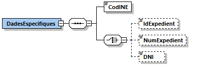
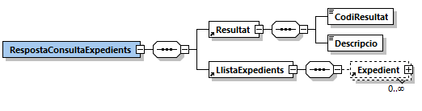
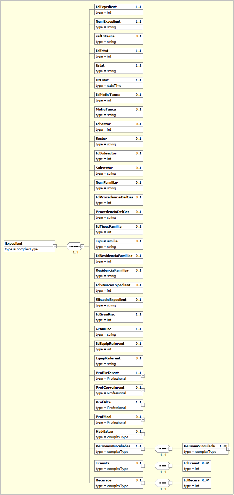
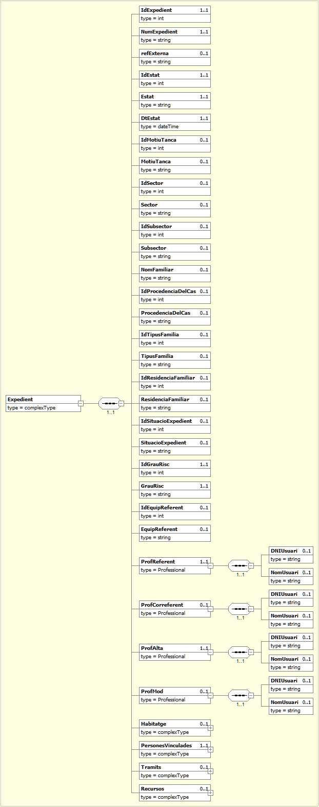
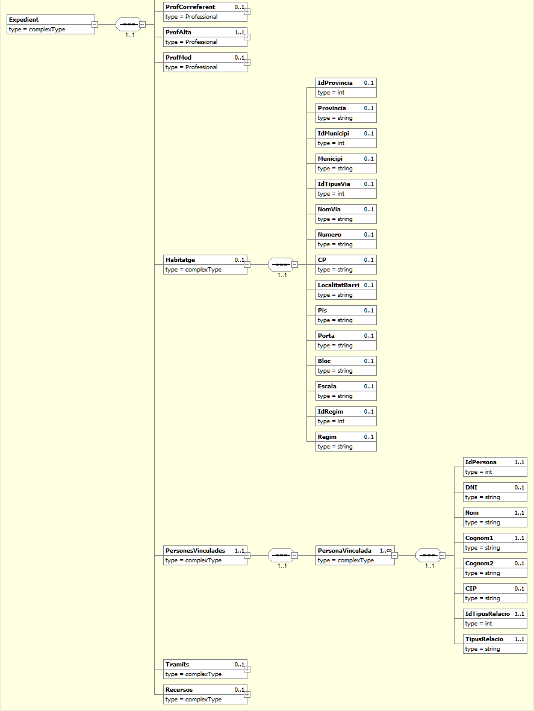

# 1. Consulta Expedient (HESTIA_EXPEDIENT)
El servei **Hèstia** tracta l’Expedient Familiar com l’eina principal de treball dels professionals d’Atenció Primària: dóna suport per al treball directe dels casos, permet orientar els processos del sistema d’intervenció i agrupa tota la informació generada en una mateixa unitat de convivència (domicili).

L'expedient engloba les dades descriptives del nucli familiar a gestionar, la llista de les persones vinculades i la seva relació dins l’expedient, dades de diagnòstic de la situació (demandes, problemàtiques), el registre temporalitzat de les avaluacions i actuacions dels professionals, els plans d’acció (plans d’intervenció), els tràmits (formularis de sol·licitud que cal omplir i presentar per demanar una prestació) i els recursos concedits.

Aquest connector permet obtenir les dades d'un expedient (ocasionalment si el paràmetre indicat és el DNI del ciutadà i aquest tingués més d’un expedient en estat obert en l’ABSS indicada, es retornaria la llista dels expedients). Per a realitzar la consulta se li ha d'indicar obligatòriament el codi INE de l'ABSS i un dels tres paràmetres d'identificació de l’expedient. Aquests paràmetres són: l’IdExpedient que és l’identificador intern de l'expedient dins l’**Hèstia**, el número d'expedient que és l’identificador únic utilitzat pels professionals de l’ABSS o el DNI de la persona vinculada a l'expedient. En cas d’indicar més d’un paràmetre, el connector farà la següent priorització:
1.	Si s’especifica l’identificador intern de l’**Hèstia**, el connector ignorarà la resta de paràmetres indicats i comprovarà l’existència de l'expedient únicament a partir de l’identificador intern. En aquest cas sempre es retornarà com a màxim 1 únic expedient.
2.	Si no s’indica l’identificador intern, i s’indica el número d'expedient, el connector ignorarà el DNI indicat i comprovarà l’existència de l'expedient a partir del número d'expedient. En aquest cas sempre es retornarà com a màxim 1 únic expedient
3.	Si no s’indica l’identificador intern ni tampoc el número d'expedient, el connector retornarà les dades de tots els expedients oberts en els quals la persona indicada (DNI/NIE/Passaport) estigui vinculada. Aquest és l’únic cas en el qual es pot retornar una llista d’expedients.
Si no s’indica cap dels paràmetres, el connector retornarà un codi d’error. 
S'ha de tenir en compte que actualment només es permet la consulta d’expedients de la pròpia ABSS que realitza la petició.
A continuació es detalla la missatgeria corresponent al bloc de dades específiques. 

## 1.1. Petició - dades específiques
La missatgeria específica de la petició *HESTIA_EXPEDIENT* es troba definida al document [Peticio_DadesEspecifiques_Expedient.xsd](xsd/Peticio_DadesEspecifiques_Expedient.xsd)



|Element | Descripció|
|------- | ----------|
|DadesEspecifiques/CodINE | Codi INE de l'Àrea Bàsica de Serveis Socials |
|DadesEspecifiques/IdExpedient | Identificador intern de l’expedient dins l’Hèstia. Aquest és el paràmetre que recomanem utilitzar sempre que sigui possible (especialment per consultes futures sobre un mateix expedient)|
|DadesEspecifiques/NumExpedient | Número d’expedient utilitzat pels professionals de l’ABSS|
|DadesEspecifiques/DNI | DNI, NIE o passaport de la persona vinculada a l'expedient.|

## 1.2. Resposta - dades específiques
La missatgeria específica de la resposta *HESTIA_EXPEDIENT* es troba definida al document [Resposta_DadesEspecifiques_Expedient.xsd](xsd/Resposta_DadesEspecifiques_Expedient.xsd)



|Element | Descripció|
|------- | ----------|
|RespostaConsultaExpedients/Resultat/CodiResultat | -1: La petició no és correcta o no compleix l’esquema|
| | -2: No s'ha localitzat l'expedient. No es retorna l’apartat *LlistaExpedients*|
| | -6: El servei Hèstia no està disponible en aquest moment. La petició s’ha de tornar a enviar més endavant|
| | -9: Només es pot accedir a informació de la pròpia ABSS que realitza la consulta|
| | 0: L’expedient s'ha localitzat correctament. Es retorna a l’apartat *LlistaExpedients* l’expedient sol·licitat|
|RespostaConsultaExpedients/Resultat/Descripcio | Missatge descriptiu del resultat de l’operació. En cas d’error es detallen els motius|
|RespostaConsultaExpedients/LlistaExpedients | Llista d’expedients localitzats, apareixerà buida en cas d'error o si no s’ha pogut localitzar l’expedient indicat. Normalment aquesta llista retornarà 1 únic expedient, ara bé, si es fa la cerca de l’expedient a partir del DNI/NIE/Passaport del ciutadà i aquest disposa de més d’un expedient obert en l’ABSS (situació que en principi no s’hauria de donar de forma habitual) llavors sí que es pot retornar una llista d’expedients|

### 1.2.1. LlistaExpedients/Expedient






|Element | Descripció|
|------- | ----------|
|//Expedient/IdExpedient | Identificador intern de l’expedient dins l’Hèstia. Per a futures consultes es recomana emprar aquest identificador si es desitja consultar aquest expedient més endavant.|
|//Expedient/NumExpedient | Número d’expedient utilitzat pels professionals de l’ABSS|
|//Expedient/refExterna | Identificador de l'expedient en els sistemes propis de l'ABSS que es pot informar per facilitar la identificació de l’expedient en aquests sistemes d’informació aliens a l’Hèstia. |
|//Expedient/IdEstat | Identificador intern de l'estat de l'expedient|
|//Expedient/Estat | Estat en el qual es troba l'expedient:|
| | 1: Obert|
| | 2: Tancat|
|//Expedient/DtEstat | Data en què l'expedient va entrar en l'estat actual|
|//Expedient/IdMotiuTanca | Identificador del motiu de tancament de l'expedient. |
|//Expedient/MotiuTanca | Descripció del motiu de tancament |
| | 1: Absència de l'usuari |
| | 2: Canvi de Domicili |
| | 3: Decisió Professional |
| | 4: Defunció |
| | 5: Resolt |
| | 6: Inactivitat de l'expedient |
| | 7: Derivació |
| | 8: Decisió de l'usuari |
|//Expedient/IdSector | Identificador únic del sector al que pertany l’expedient (primer nivell de la divisió territorial a la que pertany l'expedient i que normalment es correspon amb el municipi)|
|//Expedient/Sector | Descripció del sector al que pertany l'expedient|
|//Expedient/IdSubsector | Identificador únic del subsector al que pertany l’expedient (segon nivell de la divisió territorial a la que pertany l'expedient i que normalment es correspon amb el barri)|
|//Expedient/Subsector | Descripció del subsector al que pertany l'expedient|
|//Expedient/NomFamiliar | Text descriptiu que utilitzen els professionals de l’ABSS per identificar l’expedient de forma complementària al número d’expedient. Sovint s’utilitzen els cognoms de la família|
|//Expedient/IdProcedenciaDelCas | Identificador únic de la procedència del cas|
|//Expedient/ProcedenciaDelCas | Descripció de la procedència del cas:|
| | 0: SENSE ASSIGNAR|
| | 1: Personalment|
| | 2: Familiars|
| | 3: Responsables del Ens locals|
| | 4: Serveis d'ensenyament|
| | 5: Serveis Sanitaris|
| | 6: Cossos de Seguretat|
| | 7: Altres serveis socials|
| | 8: Serveis d'atenció a la infància i adolescència|
| | 9: Serveis de justícia|
| | 10: Associacions/ONG/Entitats|
| | 11: Veïns/amics/altres|
|//Expedient/IdTipusFamilia | Identificador del tipus d’unitat familiar|
|//Expedient/TipusFamilia | Descripció del tipus d’unitat familiar:|
| | 0: NO CONSTA|
| | 1: Unipersonal|
| | 2: Sense nucli|
| | 3: Monoparental|
| | 4: Nuclear|
| | 5: Extensa o ampliada|
| | 6: Múltiple|
| | 7: Reconstituïda|
|//Expedient/IdResidenciaFamiliar | Identificador de la residència del nucli familiar|
|//Expedient/ResidenciaFamiliar | Descripció genèrica on viuen les persones incloses a l’expedient:|
| | 0: SENSE ASSIGNAR|
| | 1: Tot a Catalunya|
| | 2: Espanya|
| | 3: Europa|
| | 4: Fora de la Unió Europea|
|//Expedient/IdSituacioExpedient | Identificador de la situació de l'expedient|
|//Expedient/SituacioExpedient | Descripció de la situació de l’expedient que es correspon la divisió dels estadis d'actuació pels quals pot passar un expedient:|
| | 0: Sense assignar|
| | 1: Acollida|
| | 2: Seguiment|
| | 3: Tractament (Pla Intervenció)|
|//Expedient/IdGrauRisc | Identificador del grau de risc d'un expedient|
|//Expedient/GrauRisc | Descripció de l’escala que determina la situació de risc per a la seva seguretat o benestar bàsic de les persones que formen part de l'expedient:|
| | 0: Sense Valorar|
| | 1: Vulnerable|
| | 2: Risc|
| | 3: Alt Risc|
|//Expedient/IdEquipReferent | Identificador de l'equip referent de l'expedient|
|//Expedient/EquipReferent | Descripció de l’equip especialitzat o temàtic assignat a l’expedient|
|//Expedient/ProfReferent |	Professional dels Serveis Socials que canalitza les prestacions que necessita la unitat de convivència i coordina tota l’activitat que es deriva|
|//Expedient/ProfReferent/DNIUsuari | DNI/NIE del professional referent|
|//Expedient/ProfReferent/NomUsuari | Nom del professional referent|
|//Expedient/ProfCorreferent/ | Professional auxiliar que exerceix les mateixes funcions que el professional referent en absència d’aquest|
|//Expedient/ProfCorreferent/DNIUsuari | DNI/NIE del professional correferent|
|//Expedient/ProfCorreferent/NomUsuari | Nom del professional correferent|
|//Expedient/ProfAlta | Professional que va donar d'alta l'expedient|
|//Expedient/ProfAlta/DNIUsuari | DNI/NIE del professional que va donar d'alta l'expedient|
|//Expedient/ProfAlta/NomUsuari | Nom del professional que va donar d'alta l'expedient|
|//Expedient/ProfMod/ | Darrer professional que va realitzar una modificació en l'expedient|
|//Expedient/ProfMod/DNIUsuari | DNI/NIE del darrer professional que va realitzar una modificació|
|//Expedient/ProfMod/NomUsuari | Nom del darrer professional que va realitzar una modificació|
|//Expedient/Habitatge | Recull informació sobre l’habitatge de la unitat de convivència|
|//Expedient/Habitatge/IdProvincia | Identificador de província on està situada l'habitatge|
|//Expedient/Habitatge/Provincia | Descripció de la província|
|//Expedient/Habitatge/IdMunicipi | Identificador del municipi on està situat l'habitatge|
|//Expedient/Habitatge/Municipi | Descripció del municipi|
|//Expedient/Habitatge/IdTipusVia | Identificador del tipus de via de l’habitatge|
|//Expedient/Habitatge/NomVia | Descripció del carrer de l'habitatge|
|//Expedient/Habitatge/Numero | Número del carrer|
|//Expedient/Habitatge/CP | Codi postal de l’habitatge|
|//Expedient/Habitatge/LocalitatBarri | Localitat o barri on està ubicat l’habitatge|
|//Expedient/Habitatge/Pis | Número de pis|
|//Expedient/Habitatge/Porta | Porta de l'habitatge|
|//Expedient/Habitatge/Bloc | Bloc de l’habitatge|
|//Expedient/Habitatge/Escala | Escala de l‘habitatge|
|//Expedient/Habitatge/IdRegim | Identificador del règim de tinença |
|//Expedient/Habitatge/Regim | Règim de tinença |
| | 1: Propietaris / Accès propietat |
| | 2: Llogaters |
| | 3: Habitatge Gratuït |
| | 4: Alberg,pensió,hotel,residència |
| | 6: Relloguer |
| | 7: Règim de masover |
| | 8: Ocupació il.legal |
| | 9: NS/NC |
| | 10: Lloguer sense contracte |
| | 11: Relloguer lloguer |
| | 12: Relloguer propietat |
|//Expedient/PersonesVinculades | Relació de persones vinculades a l’expedient|
|//Expedient/PersonesVinculades/PersonaVinculada | Dades del ciutadà vinculat a l'expedient|
|//Expedient/PersonesVinculades/PersonaVinculada/IdPersona | Identificador intern dins l’Hèstia de la persona|
|//Expedient/PersonesVinculades/PersonaVinculada/DNI | DNI/NIE/Passaport de la persona|
|//Expedient/PersonesVinculades/PersonaVinculada/Nom | Nom del vinculat|
|//Expedient/PersonesVinculades/PersonaVinculada/Cognom1 | Primer cognom de la persona|
|//Expedient/PersonesVinculades/PersonaVinculada/Cognom2 | Segon cognom de la persona|
|//Expedient/PersonesVinculades/PersonaVinculada/CIP | Codi d’identificació personal assignat per CatSalut|
|//Expedient/PersonesVinculades/PersonaVinculada/IdTipusRelacio | Identificador del tipus de relació del ciutadà amb l'expedient|
|//Expedient/PersonesVinculades/PersonaVinculada/TipusRelacio | Descripció del tipus de relació del ciutadà amb la *Persona principal*. Tot expedient ha de tenir una única *Persona principal* i per a la resta de persones vinculades s’indica la seva relació amb la *Persona principal*:|
| | 1: Altres|
| | 2: Avi/àvia, nét/a|
| | 3: Fill/a|
| | 4: Gendre/nora, sogre/a|
| | 5: Germà/ana, cunyat/ada|
| | 6: Nebot/da, cosí/ina|
| | 7: Pare/mare|
| | 8: Persona principal|
| | 9: Tiet/a|
| | 10: Espòs/osa, company/a|
|//Expedient/Tramits | Llistat de tràmits concedits a l'expedient|
|//Expedient/Tramits/IdTramit | Identificador únic del tràmit associat a l'expedient. Aquest és l’identificador que s’ha d’utilitzar en la consulta *[HESTIA_TRAMITS](ConsultaTramits.md)* si es vol obtenir els detalls del tràmit|
|//Expedient/Recursos | Llista de recursos en estat concedit vinculats a l'expedient|
|//Expedient/Recursos/IdRecurs | Identificador únic del recurs associat a l'expedient. Aquest és l’identificador que s’ha d’utilitzar en la consulta *[HESTIA_RECURSOS](ConsultaRecursos.md)* si es vol obtenir els detalls del recurs|

## 1.3. Joc de proves
El joc de proves del servei vàlid per a l’entorn de pre-producció, és el que es detalla a continuació:

|codINE | IdExpedient | NumExpedient | DNI | Resultat|
|------ | ----------- | ------------ | --- | --------|
|999999999 | | | | (-9) Només es pot accedir a informació de la pròpia ABSS que realitza la consulta|
|9821920002 | | | | (-2) No s'ha localitzat l'expedient|
|9821920002	| XYZ | | | (-1) La petició no és correcta o no compleix l’esquema|
|9821920002 | 999999999 | | | (-2) No s'ha localitzat l'expedient|
|9821920002 | | 999999999 | | (-2) No s'ha localitzat l'expedient|
|9821920002	| | | 999999999 | (-2) No s'ha localitzat l'expedient|
|9821920002 | 370034917 | | | (0) Els expedients s'han localitzat correctament|
|9821920002	| | EXP2017/00874 | | (0) Els expedients s'han localitzat correctament|
|9821920002	| | | 00181584E | (0) Els expedients s'han localitzat correctament|

## 1.4. Petició d'exemple
```xml
<soapenv:Envelope xmlns:nt="http://www.aocat.net/hestia/" xmlns:soapenv="http://schemas.xmlsoap.org/soap/envelope/">
   <soapenv:Body>
      <nt:procesa xmlns:nt="http://www.openuri.org/">
         <ns0:Peticion xmlns:ns0="http://gencat.net/scsp/esquemes/peticion">
            <ns0:Atributos>
               <ns0:IdPeticion>HESTIA_EXPEDIENT_${=UUID.randomUUID()}</ns0:IdPeticion>
               <ns0:NumElementos>1</ns0:NumElementos>
               <ns0:CodigoCertificado>HESTIA_EXPEDIENT</ns0:CodigoCertificado>
               <ns0:CodigoProducto>HESTIA</ns0:CodigoProducto>
               <ns0:DatosAutorizacion>
                  <ns0:IdentificadorSolicitante>2512070005</ns0:IdentificadorSolicitante>
                  <ns0:Finalidad>PROVES</ns0:Finalidad>
               </ns0:DatosAutorizacion>
            </ns0:Atributos>
            <ns0:Solicitudes>
               <ns0:SolicitudTransmision>
                  <ns0:DatosGenericos>
                     <ns0:Solicitante>
                        <ns0:IdentificadorSolicitante>9821920002</ns0:IdentificadorSolicitante>
                        <ns0:NombreSolicitante>CAOC</ns0:NombreSolicitante>
                        <ns0:Finalidad>PROVES</ns0:Finalidad>
                        <ns0:Consentimiento>Si</ns0:Consentimiento>
                     </ns0:Solicitante>
                     <ns0:Transmision>
                        <ns0:CodigoCertificado>HESTIA_EXPEDIENT</ns0:CodigoCertificado>
                        <ns0:IdSolicitud>171254</ns0:IdSolicitud>
                        <ns0:FechaGeneracion>2013-10-02</ns0:FechaGeneracion>
                     </ns0:Transmision>
                  </ns0:DatosGenericos>
                  <ns0:DatosEspecificos>
                     <DadesEspecifiques xmlns="http://www.aoc.cat/hestia/">
                        <CodINE>9821920002</CodINE>
                        <NumExpedient>EXP2017/00874</NumExpedient>
                     </DadesEspecifiques>
                  </ns0:DatosEspecificos>
               </ns0:SolicitudTransmision>
            </ns0:Solicitudes>
         </ns0:Peticion>
      </nt:procesa>
   </soapenv:Body>
</soapenv:Envelope>
```


## 1.5. Resposta d'exemple
```xml
<S:Envelope xmlns:S="http://schemas.xmlsoap.org/soap/envelope/">
   <S:Body>
      <ns0:procesaResponse xmlns:ns0="http://www.openuri.org/" xmlns:ns3="http://gencat.net/scsp/esquemes/respuesta" xmlns:ns2="http://gencat.net/scsp/esquemes/peticion">
         <ns3:Respuesta>
            <ns3:Atributos>
               <ns3:IdPeticion>HESTIA_EXPEDIENT_ad86a310-93fa-4982-8ab4-05a8bbdd49fe</ns3:IdPeticion>
               <ns3:NumElementos>1</ns3:NumElementos>
               <ns3:TimeStamp>2022-01-11T08:41:54.723+01:00</ns3:TimeStamp>
               <ns3:Estado>
                  <ns3:CodigoEstado>0003</ns3:CodigoEstado>
                  <ns3:LiteralError>OK</ns3:LiteralError>
                  <ns3:TiempoEstimadoRespuesta>0</ns3:TiempoEstimadoRespuesta>
               </ns3:Estado>
               <ns3:CodigoCertificado>HESTIA_EXPEDIENT</ns3:CodigoCertificado>
               <ns3:CodigoProducto>HESTIA</ns3:CodigoProducto>
            </ns3:Atributos>
            <ns3:Transmisiones>
               <ns3:TransmisionDatos>
                  <ns3:DatosGenericos>
                     <ns3:Solicitante>
                        <ns3:IdentificadorSolicitante>9821920002</ns3:IdentificadorSolicitante>
                        <ns3:NombreSolicitante>CAOC</ns3:NombreSolicitante>
                        <ns3:Finalidad>PROVES</ns3:Finalidad>
                        <ns3:Consentimiento>Si</ns3:Consentimiento>
                     </ns3:Solicitante>
                     <ns3:Transmision>
                        <ns3:CodigoCertificado>HESTIA_EXPEDIENT</ns3:CodigoCertificado>
                        <ns3:IdSolicitud>171254</ns3:IdSolicitud>
                        <ns3:IdTransmision/>
                        <ns3:FechaGeneracion>2013-10-02</ns3:FechaGeneracion>
                     </ns3:Transmision>
                  </ns3:DatosGenericos>
                  <ns3:DatosEspecificos>
                     <RespostaConsultaExpedients xmlns="http://www.aoc.cat/hestia/" xmlns:xsd="http://www.w3.org/2001/XMLSchema" xmlns:xsi="http://www.w3.org/2001/XMLSchema-instance">
                        <Resultat>
                           <CodiResultat>0</CodiResultat>
                           <Descripcio>L'expedient s'ha localitzat correctament</Descripcio>
                        </Resultat>
                        <LlistaExpedients>
                           <Expedient>
                              <IdExpedient>370034917</IdExpedient>
                              <NumExpedient>EXP2017/00874</NumExpedient>
                              <refExterna>T3ST</refExterna>
                              <IdEstat>1</IdEstat>
                              <Estat>Obert</Estat>
                              <DtEstat>2017-04-06T12:32:38.45</DtEstat>
                              <IdSector>251207</IdSector>
                              <Sector>Lleida</Sector>
                              <IdSubsector>490000071</IdSubsector>
                              <Subsector>Inclusió-Ereta</Subsector>
                              <NomFamiliar>LAZARO MALDONADO</NomFamiliar>
                              <IdProcedenciaDelCas>1</IdProcedenciaDelCas>
                              <ProcedenciaDelCas>Personalment</ProcedenciaDelCas>
                              <IdTipusFamilia>4</IdTipusFamilia>
                              <TipusFamilia>Nuclear</TipusFamilia>
                              <IdResidenciaFamiliar>4</IdResidenciaFamiliar>
                              <ResidenciaFamiliar>Fora de la Unió Europea</ResidenciaFamiliar>
                              <IdSituacioExpedient>1</IdSituacioExpedient>
                              <SituacioExpedient>Acollida</SituacioExpedient>
                              <IdGrauRisc>0</IdGrauRisc>
                              <GrauRisc>Sense Valorar</GrauRisc>
                              <IdEquipReferent>370000006</IdEquipReferent>
                              <EquipReferent>INCLUSIÓ SOCIAL</EquipReferent>
                              <ProfReferent>
                                 <DNIUsuari>00001194K</DNIUsuari>
                                 <NomUsuari>JENIFER MIRALLES PAZ</NomUsuari>
                              </ProfReferent>
                              <ProfCorreferent/>
                              <ProfAlta>
                                 <DNIUsuari>00000332X</DNIUsuari>
                                 <NomUsuari>ABRIL CAMARERO ALASA</NomUsuari>
                              </ProfAlta>
                              <ProfMod>
                                 <DNIUsuari>00000381J</DNIUsuari>
                                 <NomUsuari>NAIMA SANTANA TORRENTS</NomUsuari>
                              </ProfMod>
                              <Habitatge>
                                 <IdProvincia>27</IdProvincia>
                                 <Provincia>Lleida</Provincia>
                                 <IdRegim>9</IdRegim>
                                 <Regim>NS/NC</Regim>
                              </Habitatge>
                              <PersonesVinculades>
                                 <PersonaVinculada>
                                    <IdPersona>370001147</IdPersona>
                                    <DNI>00181584E</DNI>
                                    <Nom>CARLA</Nom>
                                    <Cognom1>MALDONADO</Cognom1>
                                    <Cognom2>MARQUES</Cognom2>
                                    <CIP>MAMA1721012002</CIP>
                                    <IdTipusRelacio>10</IdTipusRelacio>
                                    <TipusRelacio>Espòs/osa, company/a</TipusRelacio>
                                 </PersonaVinculada>
                                 <PersonaVinculada>
                                    <IdPersona>370062749</IdPersona>
                                    <DNI>00235062W</DNI>
                                    <Nom>PAULA</Nom>
                                    <Cognom1>LAZARO</Cognom1>
                                    <Cognom2>GUISADO</Cognom2>
                                    <CIP/>
                                    <IdTipusRelacio>8</IdTipusRelacio>
                                    <TipusRelacio>Persona principal</TipusRelacio>
                                 </PersonaVinculada>
                              </PersonesVinculades>
                              <Tramits>
                                 <IdTramit>370059167</IdTramit>
                                 <IdTramit>370063148</IdTramit>
                                 <IdTramit>490024808</IdTramit>
                                 <IdTramit>490035473</IdTramit>
                                 <IdTramit>490039038</IdTramit>
                                 <IdTramit>490039044</IdTramit>
                                 <IdTramit>490039530</IdTramit>
                                 <IdTramit>490042663</IdTramit>
                                 <IdTramit>490042666</IdTramit>
                                 <IdTramit>490042672</IdTramit>
                                 <IdTramit>490045816</IdTramit>
                                 <IdTramit>490045948</IdTramit>
                                 <IdTramit>490048797</IdTramit>
                                 <IdTramit>490050725</IdTramit>
                                 <IdTramit>490050732</IdTramit>
                                 <IdTramit>490059658</IdTramit>
                                 <IdTramit>490079336</IdTramit>
                                 <IdTramit>490079338</IdTramit>
                                 <IdTramit>490081695</IdTramit>
                                 <IdTramit>490093847</IdTramit>
                                 <IdTramit>490125520</IdTramit>
                                 <IdTramit>490130207</IdTramit>
                              </Tramits>
                              <Recursos>
                                 <IdRecurs>370456978</IdRecurs>
                                 <IdRecurs>370458539</IdRecurs>
                                 <IdRecurs>490103774</IdRecurs>
                                 <IdRecurs>490122074</IdRecurs>
                                 <IdRecurs>490129115</IdRecurs>
                                 <IdRecurs>490129990</IdRecurs>
                                 <IdRecurs>490135540</IdRecurs>
                                 <IdRecurs>490135563</IdRecurs>
                                 <IdRecurs>490141555</IdRecurs>
                                 <IdRecurs>490141767</IdRecurs>
                                 <IdRecurs>490148055</IdRecurs>
                                 <IdRecurs>490153470</IdRecurs>
                                 <IdRecurs>490173328</IdRecurs>
                                 <IdRecurs>490207803</IdRecurs>
                                 <IdRecurs>490207806</IdRecurs>
                                 <IdRecurs>490278541</IdRecurs>
                                 <IdRecurs>490286582</IdRecurs>
                              </Recursos>
                           </Expedient>
                        </LlistaExpedients>
                     </RespostaConsultaExpedients>
                  </ns3:DatosEspecificos>
               </ns3:TransmisionDatos>
            </ns3:Transmisiones>
         </ns3:Respuesta>
      </ns0:procesaResponse>
   </S:Body>
</S:Envelope>
```
