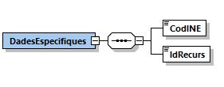
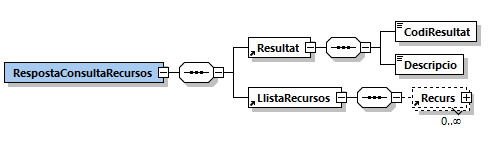
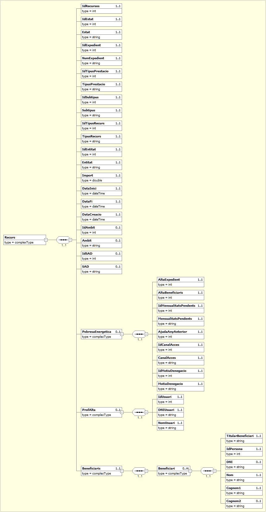

# 1. Consulta Recursos (HESTIA_RECURSOS)
Els recursos fan referència als serveis, prestacions, ajuts o intervencions sol·licitats per a un usuari dels Serveis Socials amb l'objectiu d'atenuar o solucionar les problemàtiques detectades o de satisfer les seves peticions.

Aquesta operació permet consultar les dades d’un recurs o d’una llista de recursos a partir del/s seu/s identificador/s intern/s i del Codi INE de l'Àrea Bàsica de Serveis Socials als que pertanyen. En el cas de passar una llista de recursos, el caràcter que s’haurà d’utilitzar com a separador és "," (la coma).
Si es passa una llista de recursos, no és obligatori que pertanyin al mateix expedient. El límit màxim que es pot sol·licitar en una única petició és de 100 recursos.
S'ha de tenir en compte que actualment només es permet la consulta de recursos de la pròpia ABSS que realitza la petició.
A continuació es detalla la missatgeria corresponent al bloc de dades específiques. 

## 1.1. Petició - dades específiques
La missatgeria específica de la petició *HESTIA_RECURSOS* es troba definida al document [Peticio_DadesEspecifiques_Recursos.xsd](xsd/Peticio_DadesEspecifiques_Recursos.xsd)



|Element | Descripció|
|------- | ----------|
|DadesEspecifiques/CodINE | Codi de l'Àrea Bàsica de Serveis Socials|
|DadesEspecifiques/IdRecurs | Llista d'identificadors interns de recursos del Hèstia separats per “,” (la coma). Si es desitja obtenir les dades d’un únic recurs, no cal indicar el separador “,”|

## 1.2. Resposta - dades específiques
La missatgeria específica de la resposta *HESTIA_RECURSOS* es troba definida al document [Resposta_DadesEspecifiques_Recursos.xsd](xsd/Resposta_DadesEspecifiques_Recursos.xsd)



|Element | Descripció|
|------- | ----------|
|RespostaConsultaRecursos/Resultat/CodiResultat | -1: La petició no és correcta o no compleix l’esquema|
| | -2: No s'ha localitzat el recurs. No es retorna l’apartat *LListaRecursos*|
| | -6: El servei Hèstia no està disponible en aquest moment. La petició s’ha de tornar a enviar més endavant|
| | -9: Només es pot accedir a informació de la pròpia ABSS que realitza la consulta|
| | 0: El recurs s'ha localitzat correctament. Es retorna a l’apartat *LlistaRecursos* els recursos localitzats|
|RespostaConsultaExpedients/Resultat/Descripcio | Missatge descriptiu del resultat de l’operació. En cas d’error es detallen els motius|
|RespostaConsultaExpedients/LlistaRecursos | Llista de recursos localitzats, apareixerà buida en cas d'error|

### 1.2.1. LlistaRecursos/Recurs


|Element | Descripció|
|------- | ----------|
|//Recurs/IdRecurs | Identificador únic del recurs dins l’Hèstia|
|//Recurs/IdEstat | Identificador de l’estat|
|//Recurs/Estat | Descripció de l’estat en el que es troba el recurs:|
| | 0: Preassignat|
| | 1: Concedit|
| | 2: Denegat|
| | 3: Desistiment|
|//Recurs/IdExpedient | Identificador intern de l'expedient al que pertany el recurs|
|//Recurs/NumExpedient | Número d’expedient al que pertany el recurs|
|//Recurs/IdTipusPrestacio | Identificador [del tipus de prestació](TipusRecurs.md)|
|//Recurs/TipusPrestacio | Descripció del [tipus de prestació](TipusRecurs.md)|
|//Recurs/IdSubtipus | Identificador del [subtipus de prestació](TipusRecurs.md)|
|//Recurs/Subtipus | Descripció del [subtipus de prestació](TipusRecurs.md)|
|//Recurs/IdTipusRecurs | Identificador del [tipus de recurs](TipusRecurs.md) dependent de l’ABSS|
|//Recurs/TipusRecurs | Descripció del [tipus de recurs](TipusRecurs.md)|
|//Recurs/IdEntitat | Identificador de l'entitat promotora del recurs|
|//Recurs/Entitat | Descripció de l'entitat promotora del recurs:|
| | 0: Sense assignar|
| | 1: Administració local|
| | 2: Administració comarcal|
| | 3: Administració autonòmica|
| | 4: Administració estatal|
| | 5: Entitats del tercer sector|
|//Recurs/Import | Import del recurs concedit|
|//Recurs/DataInici | Data d'inici del recurs|
|//Recurs/DataFins | Data de fi del recurs|
|//Recurs/IdAmbit | Identificador de l'àmbit del recurs|
|//Recurs/Ambit | Descripció de l’àmbit del recurs:|
| | 0: Sense assignar|
| | 1: Família|
| | 2: Infància|
| | 3: Joventut|
| | 4: Dona|
| | 5: Gent gran|
| | 6: Persones amb discapacitat|
| | 7: Reclusos / exreclusos|
| | 8: Minories ètniques|
| | 9: Marginats sense llar / transeünts|
| | 10: Toxicòmans|
| | 11: Malalts psiquiàtrics no institucionalitzats|
| | 12: Malalts terminals|
| | 13: Altres grups situació necessitat|
| | 14: Immigrants|
|//Recurs/ProfAlta | Dades del professional que ha donat d'alta el recurs|
|//Recurs/ProfAlta/DNIUsuari | DNI/NIE del professional|
|//Recurs/ProfAlta/NomUsuari | Nom del professional|
|//Recurs/Beneficiaris | Llista de persones beneficiades del recurs|
|//Recurs/Beneficiaris/TitularBeneficiari | Aquest camp indica si la persona és el “Titular” del recurs o només un “Beneficiari”|
|//Recurs/Beneficiaris/IdPersona | Identificador únic de la persona beneficiària del recurs|
|//Recurs/Beneficiaris/DNI | DNI/NIE/Passaport de la persona beneficiària del recurs|
|//Recurs/Beneficiaris/Nom | Nom del beneficiari del recurs|
|//Recurs/Beneficiaris/Cognom1 | Primer cognom del beneficiari del recurs|
|//Recurs/Beneficiaris/Cognom2 | Segon cognom del beneficiari del recurs|

## 1.3. Joc de proves
El joc de proves del servei vàlid per a l’entorn de pre-producció, és el que es detalla a continuació:

|codINE | IdRecursos | Resultat|
|------ | ---------- | ------- | 
|999999999 | | (-9) Només es pot accedir a informació de la pròpia ABSS que realitza la consulta|
|9821920002 | | (-2) No s'ha localitzat el recurs|
|9821920002	| 370265XYZ	| (-1) La petició no és correcta o no compleix l’esquema|
|9821920002	| 120000011 | (-2) No s'ha localitzat el recurs|
|9821920002	| 370265943,490173328,490278541	| (0) Els recursos s'han localitzat correctament|

## 1.4. Petició d'exemple
```xml
<soapenv:Envelope xmlns:nt="http://www.aocat.net/NT" xmlns:soapenv="http://schemas.xmlsoap.org/soap/envelope/">
   <soapenv:Body>
      <nt:procesa xmlns:nt="http://www.openuri.org/">
         <ns0:Peticion xmlns:ns0="http://gencat.net/scsp/esquemes/peticion">
            <ns0:Atributos>
               <ns0:IdPeticion>HESTIA_RECURSOS_${=UUID.randomUUID()}</ns0:IdPeticion>
               <ns0:NumElementos>1</ns0:NumElementos>
               <ns0:CodigoCertificado>HESTIA_RECURSOS</ns0:CodigoCertificado>
               <ns0:CodigoProducto>HESTIA</ns0:CodigoProducto>
               <ns0:DatosAutorizacion>
                  <ns0:IdentificadorSolicitante>2512070005</ns0:IdentificadorSolicitante>
                  <ns0:Finalidad>PROVES</ns0:Finalidad>
               </ns0:DatosAutorizacion>
            </ns0:Atributos>
            <ns0:Solicitudes>
               <ns0:SolicitudTransmision>
                  <ns0:DatosGenericos>
                     <ns0:Solicitante>
                        <ns0:IdentificadorSolicitante>9821920002</ns0:IdentificadorSolicitante>
                        <ns0:NombreSolicitante>CAOC</ns0:NombreSolicitante>
                        <ns0:Finalidad>PROVES</ns0:Finalidad>
                        <ns0:Consentimiento>Si</ns0:Consentimiento>
                     </ns0:Solicitante>
                     <ns0:Transmision>
                        <ns0:CodigoCertificado>HESTIA_RECURSOS</ns0:CodigoCertificado>
                        <ns0:IdSolicitud>171254</ns0:IdSolicitud>
                        <ns0:FechaGeneracion>2013-10-02</ns0:FechaGeneracion>
                     </ns0:Transmision>
                  </ns0:DatosGenericos>
                  <ns0:DatosEspecificos>
                     <DadesEspecifiques xmlns="http://www.aoc.cat/hestia/">
                        <CodINE>9821920002</CodINE>
                        <IdRecurs>370265943,490173328,490278541</IdRecurs>
                     </DadesEspecifiques>
                  </ns0:DatosEspecificos>
               </ns0:SolicitudTransmision>
            </ns0:Solicitudes>
         </ns0:Peticion>
      </nt:procesa>
   </soapenv:Body>
</soapenv:Envelope>
```

## 1.5. Resposta d'exemple
```xml
<S:Envelope xmlns:S="http://schemas.xmlsoap.org/soap/envelope/">
   <S:Body>
      <ns0:procesaResponse xmlns:ns0="http://www.openuri.org/" xmlns:ns3="http://gencat.net/scsp/esquemes/respuesta" xmlns:ns2="http://gencat.net/scsp/esquemes/peticion">
         <ns3:Respuesta>
            <ns3:Atributos>
               <ns3:IdPeticion>HESTIA_RECURSOS_bac352c1-3921-4e5d-8a2c-d19544acaa06</ns3:IdPeticion>
               <ns3:NumElementos>1</ns3:NumElementos>
               <ns3:TimeStamp>2020-03-06T12:51:29.710+01:00</ns3:TimeStamp>
               <ns3:Estado>
                  <ns3:CodigoEstado>0003</ns3:CodigoEstado>
                  <ns3:LiteralError>OK</ns3:LiteralError>
                  <ns3:TiempoEstimadoRespuesta>0</ns3:TiempoEstimadoRespuesta>
               </ns3:Estado>
               <ns3:CodigoCertificado>HESTIA_RECURSOS</ns3:CodigoCertificado>
               <ns3:CodigoProducto>HESTIA</ns3:CodigoProducto>
            </ns3:Atributos>
            <ns3:Transmisiones>
               <ns3:TransmisionDatos>
                  <ns3:DatosGenericos>
                     <ns3:Solicitante>
                        <ns3:IdentificadorSolicitante>9821920002</ns3:IdentificadorSolicitante>
                        <ns3:NombreSolicitante>CAOC</ns3:NombreSolicitante>
                        <ns3:Finalidad>PROVES</ns3:Finalidad>
                        <ns3:Consentimiento>Si</ns3:Consentimiento>
                     </ns3:Solicitante>
                     <ns3:Transmision>
                        <ns3:CodigoCertificado>HESTIA_RECURSOS</ns3:CodigoCertificado>
                        <ns3:IdSolicitud>171254</ns3:IdSolicitud>
                        <ns3:IdTransmision/>
                        <ns3:FechaGeneracion>2013-10-02</ns3:FechaGeneracion>
                     </ns3:Transmision>
                  </ns3:DatosGenericos>
                  <ns3:DatosEspecificos>
                     <RespostaConsultaRecursos xmlns="http://www.aoc.cat/hestia/" xmlns:xsd="http://www.w3.org/2001/XMLSchema" xmlns:xsi="http://www.w3.org/2001/XMLSchema-instance">
                        <Resultat>
                           <CodiResultat>0</CodiResultat>
                           <Descripcio>Els recursos s'han localitzat correctament</Descripcio>
                        </Resultat>
                        <LlistaRecursos>
                           <Recurs>
                              <IdRecursos>370265943</IdRecursos>
                              <IdEstat>1</IdEstat>
                              <Estat>Concedit</Estat>
                              <IdExpedient>370032296</IdExpedient>
                              <NumExpedient>EXP2016/00874</NumExpedient>
                              <IdTipusPrestacio>370000146</IdTipusPrestacio>
                              <TipusPrestacio>1. PRESTACIONS DE SERVEIS</TipusPrestacio>
                              <IdSubtipus>370000137</IdSubtipus>
                              <Subtipus>1.1 Serveis socials bàsics</Subtipus>
                              <IdTipusRecurs>370000138</IdTipusRecurs>
                              <TipusRecurs>1.1.4 Servei de menjador social</TipusRecurs>
                              <IdEntitat>1</IdEntitat>
                              <Entitat>Administració local</Entitat>
                              <Import>1</Import>
                              <DataInici>2008-06-13T00:00:00</DataInici>
                              <DataFi>1900-01-01T00:00:00</DataFi>
                              <IdAmbit>9</IdAmbit>
                              <Ambit>Marginats sense llar / transeünts</Ambit>
                              <Beneficiaris>
                                 <Beneficiari>
                                    <TitularBeneficiari>Titular</TitularBeneficiari>
                                    <IdPersona>370001147</IdPersona>
                                    <DNI>00181584E</DNI>
                                    <Nom>CARLA</Nom>
                                    <Cognom1>MALDONADO</Cognom1>
                                    <Cognom2>MARQUES</Cognom2>
                                 </Beneficiari>
                              </Beneficiaris>
                           </Recurs>
                           <Recurs>
                              <IdRecursos>490173328</IdRecursos>
                              <IdEstat>1</IdEstat>
                              <Estat>Concedit</Estat>
                              <IdExpedient>370034917</IdExpedient>
                              <NumExpedient>EXP2017/00874</NumExpedient>
                              <IdTipusPrestacio>370000417</IdTipusPrestacio>
                              <TipusPrestacio>2. PRESTACIONS ECONOMIQUES</TipusPrestacio>
                              <IdSubtipus>370000294</IdSubtipus>
                              <Subtipus>2.3 Prestacions econòmiques d'urgència social</Subtipus>
                              <IdTipusRecurs>370000323</IdTipusRecurs>
                              <TipusRecurs>2.3.2 Ajuts per a manutenció (alimentació i vestit)</TipusRecurs>
                              <IdEntitat>5</IdEntitat>
                              <Entitat>Entitats del tercer sector</Entitat>
                              <Import>0</Import>
                              <DataInici>2018-02-13T00:00:00</DataInici>
                              <DataFi>2018-03-13T00:00:00</DataFi>
                              <IdAmbit>9</IdAmbit>
                              <Ambit>Marginats sense llar / transeünts</Ambit>
                              <ProfAlta>
                                 <DNIUsuari>00001076H</DNIUsuari>
                                 <NomUsuari>ROSA SALGUERO AMAYA</NomUsuari>
                              </ProfAlta>
                              <Beneficiaris>
                                 <Beneficiari>
                                    <TitularBeneficiari>Titular</TitularBeneficiari>
                                    <IdPersona>370062749</IdPersona>
                                    <DNI>00235062W</DNI>
                                    <Nom>PAULA</Nom>
                                    <Cognom1>LAZARO</Cognom1>
                                    <Cognom2>GUISADO</Cognom2>
                                 </Beneficiari>
                              </Beneficiaris>
                           </Recurs>
                           <Recurs>
                              <IdRecursos>490278541</IdRecursos>
                              <IdEstat>0</IdEstat>
                              <Estat>Preassignat</Estat>
                              <IdExpedient>370034917</IdExpedient>
                              <NumExpedient>EXP2017/00874</NumExpedient>
                              <IdTipusPrestacio>370000144</IdTipusPrestacio>
                              <TipusPrestacio>1. PRESTACIONS DE SERVEIS</TipusPrestacio>
                              <IdSubtipus>370000137</IdSubtipus>
                              <Subtipus>1.1 Serveis socials bàsics</Subtipus>
                              <IdTipusRecurs>370000138</IdTipusRecurs>
                              <TipusRecurs>1.1.3.1 Servei d'acolliment residencial d'urgència (població general)</TipusRecurs>
                              <IdEntitat>3</IdEntitat>
                              <Entitat>Administració autonòmica</Entitat>
                              <Import>0</Import>
                              <DataInici>2018-09-19T00:00:00</DataInici>
                              <DataFi>2018-12-31T00:00:00</DataFi>
                              <IdAmbit>13</IdAmbit>
                              <Ambit>Altres grups situació necessitat</Ambit>
                              <ProfAlta>
                                 <DNIUsuari>00000543Z</DNIUsuari>
                                 <NomUsuari>JESSICA CONESA CASTAÑO</NomUsuari>
                              </ProfAlta>
                              <Beneficiaris>
                                 <Beneficiari>
                                    <TitularBeneficiari>Titular</TitularBeneficiari>
                                    <IdPersona>370062749</IdPersona>
                                    <DNI>00235062W</DNI>
                                    <Nom>PAULA</Nom>
                                    <Cognom1>LAZARO</Cognom1>
                                    <Cognom2>GUISADO</Cognom2>
                                 </Beneficiari>
                                 <Beneficiari>
                                    <TitularBeneficiari>Beneficiari</TitularBeneficiari>
                                    <IdPersona>370062749</IdPersona>
                                    <DNI>00181584E</DNI>
                                    <Nom>CARLA</Nom>
                                    <Cognom1>MALDONADO</Cognom1>
                                    <Cognom2>MARQUES</Cognom2>
                                 </Beneficiari>
                              </Beneficiaris>
                           </Recurs>
                        </LlistaRecursos>
                     </RespostaConsultaRecursos>
                  </ns3:DatosEspecificos>
               </ns3:TransmisionDatos>
            </ns3:Transmisiones>
         </ns3:Respuesta>
      </ns0:procesaResponse>
   </S:Body>
</S:Envelope>
```