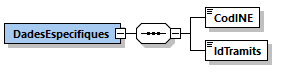
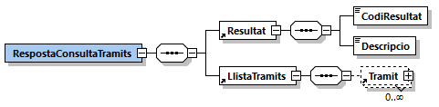
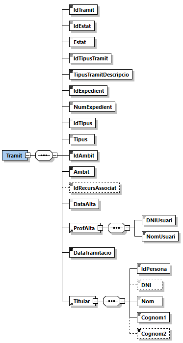

# 1. Consulta Tràmits (HESTIA_TRAMITS)
Els tràmits són els documents o formularis de sol·licitud que normalment cal omplir i presentar per tal de demanar una prestació. El programa Hèstia gestiona dos tipus de tràmits: 
* *Propis*: sol·licituds generades, dissenyades i gestionades per la pròpia Àrea Bàsica de Serveis Socials.
* *Generalitat*: sol·licituds generades i dissenyades pel Departament de Treball Afers Socials i Famílies.

Aquesta operació permet consultar les dades d'un tràmit o llista de tràmits a partir del/s seu/s identificador/s intern/s i del Codi INE de l'Àrea Bàsica de Serveis Socials als que pertanyen. En el cas de sol·licitar més d'un tràmit, el caràcter que s’haurà d’utilitzar com a separador és "," (la coma).

Si es passa una llista de tràmits, no és obligatori que pertanyin al mateix expedient. El límit màxim de tràmits que es pot sol·licitar en una única petició és de 100.

S'ha de tenir en compte que actualment només es permet la consulta de tràmits de la pròpia ABSS que realitza la petició.

A continuació es detalla la missatgeria corresponent al bloc de dades específiques. 

## 1.1. Petició - dades específiques
La missatgeria específica de la petició *HESTIA_TRAMITS* es troba definida al document [Peticio_DadesEspecifiques_Tramits.xsd](xsd/Peticio_DadesEspecifiques_Tramits.xsd)



|Element | Descripció|
|------- | ----------|
|DadesEspecifiques/CodINE | Codi INE de l'Àrea Bàsica de Serveis Socials |
|DadesEspecifiques/IdTramits | Llista d'identificadors interns de tràmits de l'Hèstia separats per “,” (la coma). Si es desitja obtenir les dades d’un únic tràmit, no cal indicar el separador “,”|

## 1.2. Resposta - dades específiques
La missatgeria específica de la resposta *HESTIA_TRAMITS* es troba definida al document [Resposta_DadesEspecifiques_Tramits.xsd](xsd/Resposta_DadesEspecifiques_Tramits.xsd)



|Element | Descripció|
|------- | ----------|
|RespostaConsultaTramits/Resultat/CodiResultat | -1: La petició no és correcta o no compleix l’esquema|
| | -2: No s'ha localitzat el tràmit. No es retorna l’apartat *LListaTramits*|
| | -6: El servei Hèstia no està disponible en aquest moment. La petició s’ha de tornar a enviar més endavant|
| | -9: Només es pot accedir a informació de la pròpia ABSS que realitza la consulta|
| | 0: El recurs s'ha localitzat correctament. Es retorna a l’apartat *LlistaTramits* tots els tràmits localitzats|
|RespostaConsultaTramits/Resultat/Descripcio | Missatge descriptiu del resultat de l’operació. En cas d’error es detallen els motius|
|RespostaConsultaTramits/LlistaTramits | Llista de tràmits localitzats, apareixerà buida en cas d'error|

### 1.2.1. LlistaTramits/Tramit


|Element | Descripció|
|------- | ----------|
|//Recurs/IdRecurs | Identificador únic del recurs dins l’Hèstia|
|//Tramit/IdTramit | Identificador únic del tràmit associat a la persona dins l’Hèstia|
|//Tramit/IdEstat | Identificador de l’estat|
|//Tramit/Estat | Descripció de l’estat en el que es troba el tràmit:|
| | 0: Tramitat|
| | 1: Concedit|
| | 2: Denegat|
|//Tramit/IdTipusTramit | Identificador del tipus de tràmit|
|//Tramit/TipusTramitDescripcio | Descripció del tipus de tràmit llistat. No s'ofereix una llista dels tràmits per què la seva gestió correspon a cada ABSS i contínuament es van donant d’alta/baixa|
|//Tramit/IdExpedient | Identificador intern de l'expedient al que pertany el tràmit|
|//Tramit/NumExpedient | Número d’expedient al que pertany el tràmit|
|//Tramit/IdTipus | Identificador del tipus de tràmit|
|//Tramit/Tipus | Descripció del tipus de tràmit:|
| | 0: Propi|
| | 1: Generalitat|
|//Tramit/IdAmbit | Identificador de l'àmbit associat al tràmit|
|//Tramit/Ambit | Descripció de l'àmbit associat al tràmit:|
| | 1: Serveis socials|
| | 2: Acolliments i adopcions|
| | 3: Dones|
| | 4: Entitats cíviques, comunitàries i de voluntariat|
| | 5: Famílies|
| | 6: Gent gran|
| | 7: Immigració|
| | 8: Infància i adolescència|
| | 9: Joventut|
| | 10: Lesbianes, gais, transsexuals, bisexuals|
| | 11: Persones amb dependència|
| | 12: Persones amb discapacitat|
| | 13: Persones amb malaltia mental|
| | 14: Reclamacions i suggeriments|
| | 15: Altres formularis|
|//Tramit/IdRecursAssociat | Identificador del recurs associat al tràmit en el cas que existeixi. L’Hèstia permet de forma opcional associar en determinats tipus de tràmits un recurs, de forma que al donar d’alta un d’aquests tràmits, automàticament es dóna d’alta el recurs associat i s’estableix el vincle entre els 2|
|//Tramit/DataAlta | Data d'alta del tràmit|
|//Tramit/ProfAlta | Dades del professional que ha donat d'alta el tràmit|
|//Tramit/ProfAlta/DNIUsuari | DNI/NIE del professional|
|//Tramit/ProfAlta/NomUsuari | Nom del professional|
|//Tramit/DataTramitacio | Data de tramitació del tràmit|
|//Tramit/Titular | Persona titular del tràmit|
|//Tramit/Titular/IdPersona | Identificador únic de la persona|
|//Tramit/Titular/DNI | DNI/NIE/Passaport del titular|
|//Tramit/Titular/Nom | Nom del titular|
|//Tramit/Titular/Cognom1 | Primer cognom del titular|
|//Tramit/Titular/Cognom2 | Segon cognom del titular|


## 1.3. Joc de proves
El joc de proves del servei vàlid per a l’entorn de pre-producció, és el que es detalla a continuació:

|codINE | IdTramits | Resultat|
|------ | --------- | ------- | 
|999999999 | | (-9) Només es pot accedir a informació de la pròpia ABSS que realitza la consulta|
|9821920002 | |	(-2) No s'ha localitzat el tràmit|
|9821920002 | 490059XYZ | (-1) La petició no és correcta o no compleix l’esquema|
|9821920002 | 4682249 | (-2) No s'ha localitzat el tràmit|
|9821920002 | 490059660,370059167,490081695 | (0) Els tràmits s'han localitzat correctament|


## 1.4. Petició d'exemple
```xml
<soapenv:Envelope xmlns:nt="http://www.aocat.net/hestia/" xmlns:soapenv="http://schemas.xmlsoap.org/soap/envelope/">
   <soapenv:Body>
      <nt:procesa xmlns:nt="http://www.openuri.org/">
         <ns0:Peticion xmlns:ns0="http://gencat.net/scsp/esquemes/peticion">
            <ns0:Atributos>
               <ns0:IdPeticion>HESTIA_TRAMITS_${=UUID.randomUUID()}</ns0:IdPeticion>
               <ns0:NumElementos>1</ns0:NumElementos>
               <ns0:CodigoCertificado>HESTIA_TRAMITS</ns0:CodigoCertificado>
               <ns0:CodigoProducto>HESTIA</ns0:CodigoProducto>
               <ns0:DatosAutorizacion>
                  <ns0:IdentificadorSolicitante>2512070005</ns0:IdentificadorSolicitante>
                  <ns0:Finalidad>PROVES</ns0:Finalidad>
               </ns0:DatosAutorizacion>
            </ns0:Atributos>
            <ns0:Solicitudes>
               <ns0:SolicitudTransmision>
                  <ns0:DatosGenericos>
                     <ns0:Solicitante>
                        <ns0:IdentificadorSolicitante>9821920002</ns0:IdentificadorSolicitante>
                        <ns0:NombreSolicitante>CAOC</ns0:NombreSolicitante>
                        <ns0:Finalidad>PROVES</ns0:Finalidad>
                        <ns0:Consentimiento>Si</ns0:Consentimiento>
                     </ns0:Solicitante>
                     <ns0:Transmision>
                        <ns0:CodigoCertificado>HESTIA_TRAMITS</ns0:CodigoCertificado>
                        <ns0:IdSolicitud>171254</ns0:IdSolicitud>
                        <ns0:FechaGeneracion>2013-10-02</ns0:FechaGeneracion>
                     </ns0:Transmision>
                  </ns0:DatosGenericos>
                  <ns0:DatosEspecificos>
                     <DadesEspecifiques xmlns="http://www.aoc.cat/hestia/">
                        <CodINE>9821920002</CodINE>
                        <IdTramits>490059660,370059167,490081695</IdTramits>
                     </DadesEspecifiques>
                  </ns0:DatosEspecificos>
               </ns0:SolicitudTransmision>
            </ns0:Solicitudes>
         </ns0:Peticion>
      </nt:procesa>
   </soapenv:Body>
</soapenv:Envelope>
```

## 1.5. Resposta d'exemple
```xml
<S:Envelope xmlns:S="http://schemas.xmlsoap.org/soap/envelope/">
   <S:Body>
      <ns0:procesaResponse xmlns:ns0="http://www.openuri.org/" xmlns:ns3="http://gencat.net/scsp/esquemes/respuesta" xmlns:ns2="http://gencat.net/scsp/esquemes/peticion">
         <ns3:Respuesta>
            <ns3:Atributos>
               <ns3:IdPeticion>HESTIA_TRAMITS_debad961-6b2b-4276-a511-d8f73fd1f6ba</ns3:IdPeticion>
               <ns3:NumElementos>1</ns3:NumElementos>
               <ns3:TimeStamp>2020-03-05T14:02:45.190+01:00</ns3:TimeStamp>
               <ns3:Estado>
                  <ns3:CodigoEstado>0003</ns3:CodigoEstado>
                  <ns3:LiteralError>OK</ns3:LiteralError>
                  <ns3:TiempoEstimadoRespuesta>0</ns3:TiempoEstimadoRespuesta>
               </ns3:Estado>
               <ns3:CodigoCertificado>HESTIA_TRAMITS</ns3:CodigoCertificado>
               <ns3:CodigoProducto>HESTIA</ns3:CodigoProducto>
            </ns3:Atributos>
            <ns3:Transmisiones>
               <ns3:TransmisionDatos>
                  <ns3:DatosGenericos>
                     <ns3:Solicitante>
                        <ns3:IdentificadorSolicitante>9821920002</ns3:IdentificadorSolicitante>
                        <ns3:NombreSolicitante>CAOC</ns3:NombreSolicitante>
                        <ns3:Finalidad>PROVES</ns3:Finalidad>
                        <ns3:Consentimiento>Si</ns3:Consentimiento>
                     </ns3:Solicitante>
                     <ns3:Transmision>
                        <ns3:CodigoCertificado>HESTIA_TRAMITS</ns3:CodigoCertificado>
                        <ns3:IdSolicitud>171254</ns3:IdSolicitud>
                        <ns3:IdTransmision/>
                        <ns3:FechaGeneracion>2013-10-02</ns3:FechaGeneracion>
                     </ns3:Transmision>
                  </ns3:DatosGenericos>
                  <ns3:DatosEspecificos>
                     <RespostaConsultaTramits xmlns="http://www.aoc.cat/hestia/" xmlns:xsd="http://www.w3.org/2001/XMLSchema" xmlns:xsi="http://www.w3.org/2001/XMLSchema-instance">
                        <Resultat>
                           <CodiResultat>0</CodiResultat>
                           <Descripcio>Els tràmits s'han localitzat correctament</Descripcio>
                        </Resultat>
                        <LlistaTramits>
                           <Tramit>
                              <IdTramit>370059167</IdTramit>
                              <IdEstat>1</IdEstat>
                              <Estat>Concedit</Estat>
                              <IdTipusTramit>370000137</IdTipusTramit>
                              <TipusTramitDescripcio>SERVEI MUNICIPAL DE MENJADOR SOCIAL - ENTREPANS</TipusTramitDescripcio>
                              <IdExpedient>370034917</IdExpedient>
                              <NumExpedient>EXP2017/00874</NumExpedient>
                              <IdTipus>0</IdTipus>
                              <Tipus>Propi</Tipus>
                              <IdAmbit>15</IdAmbit>
                              <Ambit>Altres formularis</Ambit>
                              <IdRecursAssociat>370456978</IdRecursAssociat>
                              <DataAlta>2017-04-06T13:14:54.867</DataAlta>
                              <ProfAlta>
                                 <DNIUsuari>00000332X</DNIUsuari>
                                 <NomUsuari>ABRIL CAMARERO ALASA</NomUsuari>
                              </ProfAlta>
                              <DataTramitacio>2017-04-06T13:15:26.62</DataTramitacio>
                              <Titular>
                                 <IdPersona>370062749</IdPersona>
                                 <DNI>00235062W</DNI>
                                 <Nom>PAULA</Nom>
                                 <Cognom1>LAZARO</Cognom1>
                                 <Cognom2>GUISADO</Cognom2>
                              </Titular>
                           </Tramit>
                           <Tramit>
                              <IdTramit>490059660</IdTramit>
                              <IdEstat>1</IdEstat>
                              <Estat>Concedit</Estat>
                              <IdTipusTramit>370000155</IdTipusTramit>
                              <TipusTramitDescripcio>SERVEI DE DISTRIBUCIO D'ALIMENTS - ARRELS (12)</TipusTramitDescripcio>
                              <IdExpedient>370032296</IdExpedient>
                              <NumExpedient>EXP2016/00874</NumExpedient>
                              <IdTipus>0</IdTipus>
                              <Tipus>Propi</Tipus>
                              <IdAmbit>1</IdAmbit>
                              <Ambit>Serveis socials</Ambit>
                              <IdRecursAssociat>490173330</IdRecursAssociat>
                              <DataAlta>2018-02-12T17:59:38.47</DataAlta>
                              <ProfAlta>
                                 <DNIUsuari>00001076H</DNIUsuari>
                                 <NomUsuari>ROSA SALGUERO AMAYA</NomUsuari>
                              </ProfAlta>
                              <DataTramitacio>2018-02-12T18:00:04.02</DataTramitacio>
                              <Titular>
                                 <IdPersona>370001147</IdPersona>
                                 <DNI>00181584E</DNI>
                                 <Nom>CARLA</Nom>
                                 <Cognom1>MALDONADO</Cognom1>
                                 <Cognom2>MARQUES</Cognom2>
                              </Titular>
                           </Tramit>
                           <Tramit>
                              <IdTramit>490081695</IdTramit>
                              <IdEstat>1</IdEstat>
                              <Estat>Concedit</Estat>
                              <IdTipusTramit>370000173</IdTipusTramit>
                              <TipusTramitDescripcio>SERVEI MUNICIPAL DE BUGADERIA</TipusTramitDescripcio>
                              <IdExpedient>370034917</IdExpedient>
                              <NumExpedient>EXP2017/00874</NumExpedient>
                              <IdTipus>0</IdTipus>
                              <Tipus>Propi</Tipus>
                              <IdAmbit>15</IdAmbit>
                              <Ambit>Altres formularis</Ambit>
                              <IdRecursAssociat>0</IdRecursAssociat>
                              <DataAlta>2018-04-23T11:27:21.817</DataAlta>
                              <ProfAlta>
                                 <DNIUsuari>00001076H</DNIUsuari>
                                 <NomUsuari>ROSA SALGUERO AMAYA</NomUsuari>
                              </ProfAlta>
                              <DataTramitacio>2018-04-23T11:27:00</DataTramitacio>
                              <Titular>
                                 <IdPersona>370062749</IdPersona>
                                 <DNI>00235062W</DNI>
                                 <Nom>PAULA</Nom>
                                 <Cognom1>LAZARO</Cognom1>
                                 <Cognom2>GUISADO</Cognom2>
                              </Titular>
                           </Tramit>
                        </LlistaTramits>
                     </RespostaConsultaTramits>
                  </ns3:DatosEspecificos>
               </ns3:TransmisionDatos>
            </ns3:Transmisiones>
         </ns3:Respuesta>
      </ns0:procesaResponse>
   </S:Body>
</S:Envelope>
```
