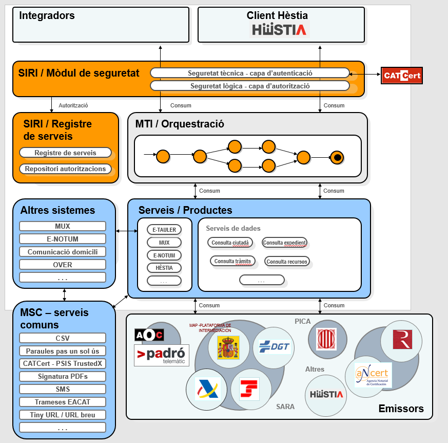

# 1. Introducció
El Sistema públic de serveis socials constitueix el conjunt de recursos, prestacions, activitats, programes, projectes i equipaments destinats a l'atenció social de la població, de titularitat de l'Administració de la Generalitat, de les entitats locals i d'altres administracions. Aquest Sistema s'organitza en forma de xarxa i diferencia entre serveis socials bàsics i serveis socials especialitzats.

El servei **Hèstia** permet gestionar bona part de les matèries que es porten a terme des d'una Àrea de Serveis Socials Bàsics (ABSS). Està format per una sèrie de mòduls que donen resposta al primer nivell del sistema públic de serveis socials, que tenen caràcter polivalent, comunitari i preventiu i als equips multidisciplinaris que el fan servir com a eina bàsica de treball.

A continuació es descriu les diferents modalitats de consum que s'ofereixen per al servei **Hèstia** i que estan a disposició dels integradors. El Backend de l'**Hèstia** s'integra dins de l'arquitectura de la Plataforma de Col·laboració Interadministrativa (en endavant _PCI_) a mode d'un nou servei accessible a través de la MTI.

Per tant els integradors que vulguin consumir els serveis de l'**Hèstia** ho hauran de fer a través de la missatgeria de la _PCI_ utilitzant l'element `<DatosEspecificos>` d'aquesta. Per a més informació podeu consultar [el document d'integració de la _PCI_](https://www.aoc.cat/knowledge-base/plataforma-de-col-laboracio-administrativa-2)

Tots els serveis oferts de l'**Hèstia** han de ser consumits en modalitat síncrona i fent ús d'una operació per petició. El resultat de l'operació s'inclou en l'element de tipus `Respuesta`. 

## 1.1. Serveis disponibles

### 1.1.1. [Consulta fitxa de persona (HESTIA_CONSULTA_CIUTADA)](ConsultaCiutada.md)
Consulta les dades de la fitxa de persona d’un ciutadà.

### 1.1.2. [Consulta expedient (HESTIA_EXPEDIENT)](ConsultaExpedient.md)
Consulta les dades d’un expedient d'atenció primària (les dades de la unitat de convivència ubicada en un domicili concret).

### 1.1.3. [Consulta recursos (HESTIA_RECURSOS)](ConsultaRecursos.md)
Consulta les dades d'una llista de recursos a partir dels seus identificadors únics.

### 1.1.4. [Consulta tràmits (HESTIA_TRAMITS)](ConsultaTramits.md)
Consulta les dades d'una llista de tràmits a partir dels seus identificadors únics.

### 1.1.5. [Consulta cites agenda (HESTIA_CITES)](ConsultaCites.md)
Consulta les cites de l'agenda.	

### 1.1.6. [Resolució de recurs (HESTIA_RESOLUCIORECURS)](ResolucioRecurs.md)

Resolució de recurs.	

### 1.1.6. [Avís nou recurs](AvisNouRecurs.md)

Avís nou recurs.	

