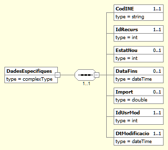
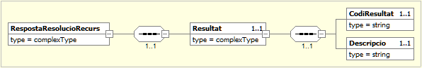

# 1. Resolució de recurs (HESTIA_RESOLUCIORECURS)
L'objectiu d'aquest servei és permetre l'actualització de l'estat d'un recurs de manera externa al servei Hèstia. Al procés de modificació de l'estat d'un recurs l'anomenem resolució del recurs. És important destacar que **només es podran resoldre recursos d'ABSS que tinguin implementat i disponible el servei** [`Avís nou recurs`](AvisNouRecurs.md) i que només es permetran actualitzar recursos associats a l'ABBS que realitza la petició.

Per a poder realitzar l'actualització serà necessari indicar una sèrie  de paràmetres per a localitzar el recurs de manera unívoca. Serà obligatori indicar el codi INE de l'ABSS (`CodINE`), l'identificador intern del recurs a l'Hèstia (`IdRecurs`) i els camps del recurs que es desitgen actualitzar: l'estat del recurs (`EstatNou`), la data de finalització (`DataFins`) i l'import del recurs (`Import`). Finalment, caldrà informar l'identificador intern del professional que sol·licita l'operació (`IdUsrMod`) i la data (`DtModificacio`) per poder traçar i auditar la resolució. 

És necessari indicar que només es permetran actualitzar recursos associats a l'ABBS que realitza la petició. A més, tots els paràmetres són obligatoris.  Per tant, s'aconsella realitzar una consulta sobre el recurs abans de  realitzar l'actualització, amb la finalitat d'obtenir els valors actuals del recurs. D'aquesta manera es podrà enviar el valor que actualment té el recurs, si no es vol modificar algun dels valors.


A continuació es detalla la missatgeria corresponent al bloc de dades específiques. 


## 1.1. Petició - dades específiques
La missatgeria específica de la petició *HESTIA_RESOLUCIORECURS* es troba definida al document [Peticio_DadesEspecifiques_ResolucioRecurs.xsd](xsd/Peticio_DadesEspecifiques_ResolucioRecurs.xsd)



|Element | Descripció|
|------- | ----------|
|DadesEspecifiques/CodINE | Codi INE de l'Àrea Bàsica de Serveis Socials |
|DadesEspecifiques/IdRecurs | Identificador intern d'un recurs dins de l'Hèstia. |
|DadesEspecifiques/EstatNou | Identificador del nou estat que es vol assignar al recurs |
| | 0: Preassignat |
| | 1: Concedit |
| | 2: Denegat |
| | 3: Desistiment |
|DadesEspecifiques/DataFins | Nova data de finalització del recurs |
|DadesEspecifiques/Import | Import del recurs concedit |
|DadesEspecifiques/IdUsrMod | Identificador intern del professional que realitza la modificació |
|DadesEspecifiques/DtModificacio | Data en la qual es realitza la modificació |

## 1.2. Resposta - dades específiques
La missatgeria específica de la resposta *HESTIA_RECURSOS* es troba definida al document [Resposta_DadesEspecifiques_ResolucioRecursos.xsd](xsd/Resposta_DadesEspecifiques_ResolucioRecursos.xsd)



|Element | Descripció|
|------- | ----------|
|RespostaConsultaRecursos/Resultat/CodiResultat | -1: La petició no és correcta o no compleix l’esquema|
| | -2: Identificador de recurs no vàlid |
| | -3: L'entitat no s'ha localitzat. No s'ha trobat l'entitat associada al codi d'àrea bàsica subministrat. |
| | -4: Professional no reconegut |
| | -5: Estat invàlid |
| | -9: Només es pot accedir a informació de la pròpia ABSS que realitza la consulta|
| | 0: Resolució del recurs <IdRecurs> reeixida |
|RespostaConsultaExpedients/Resultat/Descripcio | Missatge descriptiu del resultat de l’operació. En cas d’error es detallen els motius|

## 1.3. Joc de proves
El joc de proves del servei vàlid per a l’entorn de pre-producció, és el que es detalla a continuació:

|codINE | IdRecurs | EstatNou | DataFins | Import | IdUsrMod | DtModificacio | Resultat|
|------ | ---------- |------ |------ |------ |------ |------ |------ |
|999999999 | | | | | | | (-9) Només es pot accedir a informació de la pròpia ABSS que realitza la consulta|
|9821920002 | 100 | | | | | | (-2)  Identificador de recurs no vàlid |
|9821920002	| 840447028 | 1 | 2020-03-03T23:00:00.000 | 150.12 | 0 | 2020-03-03T23:00:00.000 | (-4) Professional no reconegut |
|9821920002	| 840447028	| 100	| 2020-03-03T23:00:00.000	| 150.12	| 370000000	| 2020-03-03T12:08:52.000	| (-5) Estat invàlid |
|9821920002	| 840447028	| 1	| 2020-03-03T23:00:00.000	| 150.12	| 370000000	| 2020-03-03T12:08:52.000	| (0) Resolució del recurs 840447028 reeixida |

## 1.4. Petició d'exemple
```xml
<soapenv:Envelope xmlns:nt="http://www.aocat.net/hestia/" xmlns:soapenv="http://schemas.xmlsoap.org/soap/envelope/">
   <soapenv:Body>
      <nt:procesa xmlns:nt="http://www.openuri.org/">
         <ns0:Peticion xmlns:ns0="http://gencat.net/scsp/esquemes/peticion">
            <ns0:Atributos>
               <ns0:IdPeticion>HESTIA_RESOLUCIORECURS_${=UUID.randomUUID()}</ns0:IdPeticion>
               <ns0:NumElementos>1</ns0:NumElementos>
               <ns0:CodigoCertificado>HESTIA_RECURSOS</ns0:CodigoCertificado>
               <ns0:CodigoProducto>HESTIA</ns0:CodigoProducto>
               <ns0:DatosAutorizacion>
                  <ns0:IdentificadorSolicitante>2512070005</ns0:IdentificadorSolicitante>
                  <ns0:Finalidad>PROVES</ns0:Finalidad>
               </ns0:DatosAutorizacion>
            </ns0:Atributos>
            <ns0:Solicitudes>
               <ns0:SolicitudTransmision>
                  <ns0:DatosGenericos>
                     <ns0:Solicitante>
                        <ns0:IdentificadorSolicitante>9821920002</ns0:IdentificadorSolicitante>
                        <ns0:NombreSolicitante>CAOC</ns0:NombreSolicitante>
                        <ns0:Finalidad>PROVES</ns0:Finalidad>
                        <ns0:Consentimiento>Si</ns0:Consentimiento>
                     </ns0:Solicitante>
                     <ns0:Transmision>
                        <ns0:CodigoCertificado>HESTIA_RESOLUCIORECURS</ns0:CodigoCertificado>
                        <ns0:IdSolicitud>171254</ns0:IdSolicitud>
                        <ns0:FechaGeneracion>2013-10-02</ns0:FechaGeneracion>
                     </ns0:Transmision>
                  </ns0:DatosGenericos>
                  <ns0:DatosEspecificos>
                     <DadesEspecifiques xmlns="http://www.aoc.cat/hestia/">
                        <CodINE>9821920002</CodINE>
                        <IdRecurs>840447028</IdRecurs>
                        <EstatNou>1</EstatNou>
                        <DataFins>2020-03-03T23:00:00.000</DataFins>
                        <Import>334.3</Import>
                        <IdUsrMod>370000000</IdUsrMod>
                        <DtModificacio>2020-03-03T12:08:52.000</DtModificacio>
                     </DadesEspecifiques>
                  </ns0:DatosEspecificos>
               </ns0:SolicitudTransmision>
            </ns0:Solicitudes>
         </ns0:Peticion>
      </nt:procesa>
   </soapenv:Body>
</soapenv:Envelope>
```

## 1.5. Resposta d'exemple
```xml
<S:Envelope xmlns:S="http://schemas.xmlsoap.org/soap/envelope/">
   <S:Body>
      <ns0:procesaResponse xmlns:ns0="http://www.openuri.org/" xmlns:ns3="http://gencat.net/scsp/esquemes/respuesta" xmlns:ns2="http://gencat.net/scsp/esquemes/peticion">
         <ns3:Respuesta>
            <ns3:Atributos>
               <ns3:IdPeticion>HESTIA_RESOLUCIORECURS_bac352c1-3921-4e5d-8a2c-d19544acaa06</ns3:IdPeticion>
               <ns3:NumElementos>1</ns3:NumElementos>
               <ns3:TimeStamp>2020-03-06T12:51:29.710+01:00</ns3:TimeStamp>
               <ns3:Estado>
                  <ns3:CodigoEstado>0003</ns3:CodigoEstado>
                  <ns3:LiteralError>OK</ns3:LiteralError>
                  <ns3:TiempoEstimadoRespuesta>0</ns3:TiempoEstimadoRespuesta>
               </ns3:Estado>
               <ns3:CodigoCertificado>HESTIA_RESOLUCIORECURS</ns3:CodigoCertificado>
               <ns3:CodigoProducto>HESTIA</ns3:CodigoProducto>
            </ns3:Atributos>
            <ns3:Transmisiones>
               <ns3:TransmisionDatos>
                  <ns3:DatosGenericos>
                     <ns3:Solicitante>
                        <ns3:IdentificadorSolicitante>9821920002</ns3:IdentificadorSolicitante>
                        <ns3:NombreSolicitante>CAOC</ns3:NombreSolicitante>
                        <ns3:Finalidad>PROVES</ns3:Finalidad>
                        <ns3:Consentimiento>Si</ns3:Consentimiento>
                     </ns3:Solicitante>
                     <ns3:Transmision>
                        <ns3:CodigoCertificado>HESTIA_RESOLUCIORECURS</ns3:CodigoCertificado>
                        <ns3:IdSolicitud>171254</ns3:IdSolicitud>
                        <ns3:IdTransmision/>
                        <ns3:FechaGeneracion>2013-10-02</ns3:FechaGeneracion>
                     </ns3:Transmision>
                  </ns3:DatosGenericos>
                  <ns3:DatosEspecificos>
                     <RespostaResolucioRecurs xmlns="http://www.aoc.cat/hestia/" xmlns:xsd="http://www.w3.org/2001/XMLSchema" xmlns:xsi="http://www.w3.org/2001/XMLSchema-instance">
                        <Resultat>
                           <CodiResultat>0</CodiResultat>
                           <Descripcio>Resolució del recurs 840447028 reeixida</Descripcio>
                        </Resultat>
                     </RespostaResolucioRecurs>
                  </ns3:DatosEspecificos>
               </ns3:TransmisionDatos>
            </ns3:Transmisiones>
         </ns3:Respuesta>
      </ns0:procesaResponse>
   </S:Body>
</S:Envelope>
```
